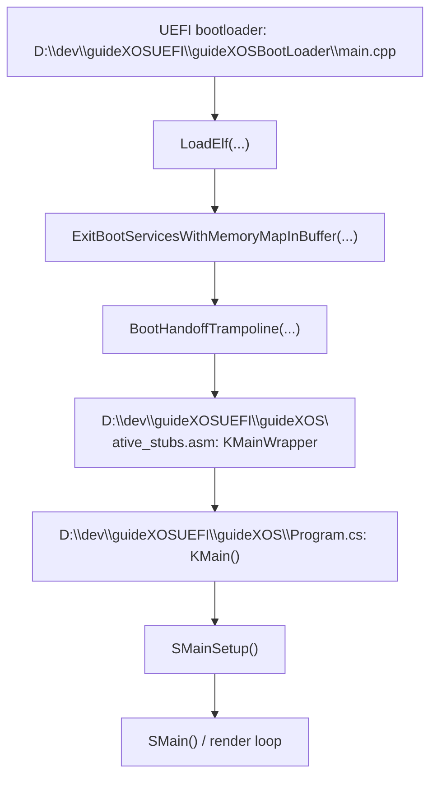

# guideXOS C# NativeAOT Reuse Audit

## 1. Executive Summary

The legacy guideXOS C# trees are not a transplant target for guideXOS Server. They are best understood as a bare-metal .NET NativeAOT/ILCompiler operating-system prototype whose codebase contains a mix of real runtime scaffolding, compiler-facing hooks, and many intentionally stubbed or incomplete paths.

What looks genuinely reusable for Server is narrow:

* The NativeAOT-era ideas around a runtime-neutral host boundary, runtime exports, module-table driven static initialization, and symbol-driven entry selection.
* The PE -> ELF staging and symbol-map tooling in `D:\dev\guideXOSUEFI\tools\pe_to_elf_v2.py` and the related packaging scripts.
* The managed-side source patterns that show how a minimal payload can be kept small, enter through a native bootstrap stub, and hand control to a single managed entry routine.

What does not look reusable as-is:

* The old kernel, window manager, scheduler, input stack, and direct framebuffer access.
* The object layout, GC assumptions, exception internals, and synchronization helpers as exposed in the legacy runtime files.
* Any approach that would expose managed object references or managed heap layout to the Server kernel.

The strongest single conclusion is that the legacy trees are useful as design and behavior reference material for an isolated managed adapter layer, but not as a source tree to import into Server.

The recommended next experiment is intentionally narrow: build a minimal AMD64 managed payload using the existing guideXOS C# NativeAOT pipeline, omit GUI/filesystem/networking/threading, package it as a Server-loadable ELF, call exactly one logging host function, and exit cleanly. That experiment should happen only after the boundary remains in place.

## 2. Repository and Source Locations

I checked three relevant roots:

* `D:\dev\guideXOS` - legacy BIOS-only guideXOS C# tree.
* `D:\dev\guideXOSUEFI` - legacy UEFI-oriented guideXOS C# tree.
* `D:\dev\guideXOSServerV1.1_DOTNET_SUPPORT` - current guideXOS Server tree.

Primary legacy source locations:

* `D:\dev\guideXOS\guideXOS\Program.cs`
* `D:\dev\guideXOS\guideXOS\guideXOS.csproj`
* `D:\dev\guideXOS\Corlib\Corlib.projitems`
* `D:\dev\guideXOS\Corlib\Internal\Runtime\CompilerHelpers\StartupCodeHelpers.cs`
* `D:\dev\guideXOS\Corlib\Internal\Runtime\CompilerHelpers\InteropHelpers.cs`
* `D:\dev\guideXOS\Corlib\Internal\Runtime\CompilerHelpers\SynchronizedMethodHelpers.cs`
* `D:\dev\guideXOS\Corlib\System\Runtime\CompilerServices\ClassConstructorRunner.cs`
* `D:\dev\guideXOS\Corlib\System\Runtime\CompilerServices\StaticClassConstructionContext.cs`
* `D:\dev\guideXOS\Corlib\System\Runtime\TypeCast.cs`
* `D:\dev\guideXOS\Corlib\System\Object.cs`
* `D:\dev\guideXOS\Corlib\System\Array.cs`
* `D:\dev\guideXOS\Corlib\System\String.cs`
* `D:\dev\guideXOS\Corlib\System\Exception.cs`
* `D:\dev\guideXOS\Corlib\System\Threading\Monitor.cs`
* `D:\dev\guideXOS\Kernel\Misc\Threading.cs`
* `D:\dev\guideXOS\guideXOS\Kernel\Win32Shim.cs`
* `D:\dev\guideXOS\Tools\EntryPoint.asm`
* `D:\dev\guideXOS\Tools\Trampoline.asm`

Primary UEFI legacy source locations:

* `D:\dev\guideXOSUEFI\guideXOS\Program.cs`
* `D:\dev\guideXOSUEFI\guideXOS\guideXOS.csproj`
* `D:\dev\guideXOSUEFI\Corlib\Corlib.projitems`
* `D:\dev\guideXOSUEFI\Corlib\Internal\Runtime\CompilerHelpers\StartupCodeHelpers.cs`
* `D:\dev\guideXOSUEFI\Corlib\Internal\Runtime\CompilerHelpers\InteropHelpers.cs`
* `D:\dev\guideXOSUEFI\Corlib\Internal\Runtime\CompilerHelpers\SynchronizedMethodHelpers.cs`
* `D:\dev\guideXOSUEFI\Corlib\System\Runtime\CompilerServices\ClassConstructorRunner.cs`
* `D:\dev\guideXOSUEFI\Corlib\System\Runtime\CompilerServices\StaticClassConstructionContext.cs`
* `D:\dev\guideXOSUEFI\Corlib\System\Runtime\TypeCast.cs`
* `D:\dev\guideXOSUEFI\Corlib\System\Object.cs`
* `D:\dev\guideXOSUEFI\Corlib\System\Array.cs`
* `D:\dev\guideXOSUEFI\Corlib\System\String.cs`
* `D:\dev\guideXOSUEFI\Corlib\System\Exception.cs`
* `D:\dev\guideXOSUEFI\Corlib\System\Threading\Monitor.cs`
* `D:\dev\guideXOSUEFI\Kernel\Misc\Threading.cs`
* `D:\dev\guideXOSUEFI\guideXOS\Kernel\Win32Shim.cs`
* `D:\dev\guideXOSUEFI\guideXOS\native_stubs.asm`
* `D:\dev\guideXOSUEFI\guideXOSBootLoader\main.cpp`
* `D:\dev\guideXOSUEFI\guideXOSBootLoader\trampoline.asm`
* `D:\dev\guideXOSUEFI\guideXOSBootLoader\handoff_trampoline.asm`
* `D:\dev\guideXOSUEFI\tools\pe_to_elf.py`
* `D:\dev\guideXOSUEFI\tools\pe_to_elf_v2.py`
* `D:\dev\guideXOSUEFI\tools\ramdisk_builder.py`
* `D:\dev\guideXOSUEFI\build.ps1`
* `D:\dev\guideXOSUEFI\check_env.ps1`

Current Server-side bridge and host-runtime locations that matter for the next experiment:

* `D:\dev\guideXOSServerV1.1_DOTNET_SUPPORT\native_app_runtime.h`
* `D:\dev\guideXOSServerV1.1_DOTNET_SUPPORT\native_app_runtime.cpp`
* `D:\dev\guideXOSServerV1.1_DOTNET_SUPPORT\native_elf_executor.cpp`
* `D:\dev\guideXOSServerV1.1_DOTNET_SUPPORT\native_elf_launch_pipeline.cpp`
* `D:\dev\guideXOSServerV1.1_DOTNET_SUPPORT\native_elf_image_loader.cpp`
* `D:\dev\guideXOSServerV1.1_DOTNET_SUPPORT\elf_validator.cpp`
* `D:\dev\guideXOSServerV1.1_DOTNET_SUPPORT\app_launch_resolver.cpp`
* `D:\dev\guideXOSServerV1.1_DOTNET_SUPPORT\app_manifest_loader.cpp`
* `D:\dev\guideXOSServerV1.1_DOTNET_SUPPORT\Apps\HelloWorld\app.json`
* `D:\dev\guideXOSServerV1.1_DOTNET_SUPPORT\Apps\ResourceViewer\app.json`

I also searched both legacy trees for `RuntimeImport` and found no matches. The explicit mechanisms in the source are `[RuntimeExport]`, `[DllImport("*")]`, custom `delegate*` function pointers, and `InternalCall` placeholders.

## 3. Confirmed .NET/runtime Version

The version evidence is mixed, but the safest confirmed statement is:

* The legacy code is clearly from the NativeAOT / ILCompiler lineage.
* The exact upstream NativeAOT commit or tag is not proven by the repository evidence I found.
* The trees pin a very old ILCompiler package, `Microsoft.DotNet.ILCompiler` `7.0.0-alpha.1.22074.1`.

| Tree | Evidence | What can be stated confidently |
|---|---|---|
| `D:\dev\guideXOS\guideXOS\guideXOS.csproj` | `TargetFramework` `net9.0`, `PlatformTarget` `x64`, `RuntimeIdentifier` `win-x64`, `EntryPointSymbol` `Entry`, `LinkerSubsystem` `NATIVE`, `Microsoft.DotNet.ILCompiler` `7.0.0-alpha.1.22074.1` | This tree targets a modern TFM but still uses an old NativeAOT-era ILCompiler package pin. |
| `D:\dev\guideXOSUEFI\guideXOS\guideXOS.csproj` | `TargetFramework` `net7.0`, `PlatformTarget` `x64`, `RuntimeIdentifier` `win-x64`, `EntryPointSymbol` `KMainWrapper`, `LinkerSubsystem` `NATIVE`, `Microsoft.DotNet.ILCompiler` `7.0.0-alpha.1.22074.1`, explicit `PackageDefinitions` to the same package path | This tree is the clearest .NET 7-era NativeAOT/ILCompiler snapshot. |
| `D:\dev\guideXOSUEFI\check_env.ps1` | Host checks for `.NET 9 SDK` and `objcopy` | The build environment was later updated, but that does not change the legacy runtime package origin. |

I could not prove an exact upstream runtime commit, tag, or SDK package origin beyond the pinned package version and the NativeAOT/CoreRT-style source layout.

## 4. Complete Build Pipeline

There are two related legacy build paths. The UEFI path is the one that most clearly shows the full managed pipeline from C# source to a bootable artifact.

### 4.1 BIOS tree pipeline

The BIOS tree uses the `BuildISO` target in `D:\dev\guideXOS\guideXOS\guideXOS.csproj:75-156`.

| Stage | Tool or command | Input | Output | Relevant files | Server reuse |
|---|---|---|---|---|---|
| NativeAOT publish | `dotnet publish` is invoked by MSBuild in the project target, with optional `--no-restore` | C# sources, `Corlib`, native libs if present | Native PE output under `bin\...\native\guideXOS.exe` | `D:\dev\guideXOS\guideXOS\guideXOS.csproj:61, 75-156` | The idea of a native managed payload is reusable only as an isolated experiment, not as a Server build dependency. |
| Native stub assembly | NASM builds `Tools\EntryPoint.asm` and `Tools\Trampoline.asm` | Bootloader assembly | Loader object and trampoline object | `D:\dev\guideXOS\guideXOS\guideXOS.csproj:75-156`, `D:\dev\guideXOS\Tools\EntryPoint.asm`, `D:\dev\guideXOS\Tools\Trampoline.asm` | Not reusable in Server; this is bare-metal boot glue. |
| Image stitching | `cmd.exe /c copy /b loader.o + guideXOS.exe kernel.bin` | Loader object + native exe | `kernel.bin` | `D:\dev\guideXOS\guideXOS\guideXOS.csproj:75-156` | Not reusable. |
| ISO construction | `mkisofs.exe` on the `grub2` tree | Boot files and ramdisk | Bootable ISO | `D:\dev\guideXOS\guideXOS\guideXOS.csproj:75-156` | Not reusable for Server. |

The BIOS path is therefore a direct bootable-OS pipeline, not a server-side app packaging pipeline.

### 4.2 UEFI tree pipeline

The UEFI tree has a more explicit, documentable managed pipeline in `D:\dev\guideXOSUEFI\build.ps1`.

| Stage | Tool or command | Input | Output | Relevant files | Server reuse |
|---|---|---|---|---|---|
| NativeAOT publish | `dotnet publish D:\dev\guideXOSUEFI\guideXOS\guideXOS.csproj -c Release` | `Program.cs`, `Corlib`, native stubs, ILCompiler package | Native PE `guideXOS.exe` plus `Kernel.map` | `D:\dev\guideXOSUEFI\build.ps1:363-403`, `D:\dev\guideXOSUEFI\guideXOS\guideXOS.csproj:5-28, 61-91, 98-106, 151-205` | The native-payload idea is reusable only if isolated from the normal Server build. |
| Native stub assembly | NASM compiles `native_stubs.asm` via the `BuildNativeStubs` target | `native_stubs.asm` | `native_stubs.obj` | `D:\dev\guideXOSUEFI\guideXOS\guideXOS.csproj:61-65`, `D:\dev\guideXOSUEFI\guideXOS\native_stubs.asm` | Useful as a bootstrap pattern reference only. |
| PE -> ELF conversion | `python tools\pe_to_elf_v2.py input.exe output.elf --map Kernel.map --symbol KMain` | Native PE and map file | Real ELF64 executable | `D:\dev\guideXOSUEFI\build.ps1:466-482`, `D:\dev\guideXOSUEFI\tools\pe_to_elf_v2.py:2, 18-20, 99, 248-260` | Potentially reusable as a staging utility for a future managed payload proof. |
| Ramdisk packaging | `python tools\ramdisk_builder.py ramdisk_src ESP\ramdisk.img` | Files under `Ramdisk\` | Custom `RDSK` ramdisk image | `D:\dev\guideXOSUEFI\build.ps1:540`, `D:\dev\guideXOSUEFI\tools\ramdisk_builder.py:1-20` | Mostly design/reference material. |
| Boot image assembly | `build.ps1` assembles the `ESP` folder and QEMU launch path | `BOOTX64.EFI`, `kernel.elf`, `ramdisk.img` | Bootable UEFI image tree | `D:\dev\guideXOSUEFI\build.ps1`, `D:\dev\guideXOSUEFI\guideXOS\guideXOS.csproj:180-205` | Not reusable for Server, but useful as a packaging reference. |

Important command and file details:

* `D:\dev\guideXOSUEFI\build.ps1:372-403` uses `dotnet publish` explicitly because, as the script comments say, `dotnet publish` triggers NativeAOT compilation while `dotnet build` would only produce IL.
* `D:\dev\guideXOSUEFI\build.ps1:480-482` prefers `pe_to_elf_v2.py` because NativeAOT `RuntimeExport` symbols can point into the middle of a function and need a prologue search.
* `D:\dev\guideXOSUEFI\tools\pe_to_elf_v2.py:248-260` defaults the symbol name to `KMain`, resolves it from the map file, and then converts the PE image into ELF64.
* `D:\dev\guideXOSUEFI\tools\ramdisk_builder.py:1-20` builds a custom `RDSK` format with a simple header and per-file records.

## 5. Runtime Startup Call Flow

### 5.1 UEFI tree, explicit call flow

The UEFI path is the best-proven startup sequence in source:

* `D:\dev\guideXOSUEFI\guideXOSBootLoader\main.cpp:437, 923, 1103` loads the kernel ELF, exits boot services, and hands off through `BootHandoffTrampoline(...)`.
* `D:\dev\guideXOSUEFI\guideXOSBootLoader\handoff_trampoline.asm:5-27, 29-36, 93, 925-930` documents the MS x64 ABI handoff and ends by jumping to the kernel entry with `RCX = bootInfo`.
* `D:\dev\guideXOSUEFI\guideXOS\guideXOS.csproj:25-26` sets `EntryPointSymbol` to `KMainWrapper`.
* `D:\dev\guideXOSUEFI\guideXOS\native_stubs.asm:29-30, 293` exports `KMainWrapper` and then `jmp KMain`.
* `D:\dev\guideXOSUEFI\guideXOS\Program.cs:22, 1170, 1441, 1514, 1546` shows that `Main()` is empty, `KMain()` does the startup work, and `SMain()` plus `SMainSetup()` handle the runtime body.

### 5.2 BIOS tree, partially inferred bridge

The BIOS tree has the same broad shape, but the bridge from the PE entry symbol to the managed `KMain()` is less explicit in source:

* `D:\dev\guideXOS\guideXOS\guideXOS.csproj:22-23` sets `EntryPointSymbol` to `Entry` and `LinkerSubsystem` to `NATIVE`.
* `D:\dev\guideXOS\guideXOS\Program.cs:21, 57-58, 205` shows an empty `Main()`, a `[RuntimeExport("KMain")]` managed entry, and `SMain()` as the main loop.
* `D:\dev\guideXOS\Tools\EntryPoint.asm:78, 129` shows the bare-metal loader switching to long mode and then calling into the kernel entry point.

I did not find a source file that directly spells out the generated bridge from the BIOS tree's `Entry` symbol into managed `KMain()`. That bridge is likely toolchain-generated or represented only in the produced map/native output, so I am not claiming more than the source proves.

### 5.3 Static constructor initialization

Two files show the managed static-constructor story:

* `D:\dev\guideXOS\Corlib\System\Runtime\CompilerServices\ClassConstructorRunner.cs:8-30`
* `D:\dev\guideXOS\Corlib\System\Runtime\CompilerServices\StaticClassConstructionContext.cs:7-16`

The important points are:

* `StaticClassConstructionContext` stores a `cctorMethodAddress` and an `initialized` flag.
* `ClassConstructorRunner.CheckStaticClassConstruction(...)` is intentionally simplified and runs the constructor once, without full multi-thread race handling.
* `D:\dev\guideXOS\Corlib\Internal\Runtime\CompilerHelpers\StartupCodeHelpers.cs:135-174` walks the ReadyToRun module table, initializes GC static regions, and runs eager class constructors.
* `D:\dev\guideXOSUEFI\guideXOS\native_stubs.asm:13-17` exports `__modules_a` to return `__Module`, which is the module-table pointer the runtime helper consumes.

### 5.4 Entry, arguments, and exit behavior

* `Main()` is present in both trees but empty (`D:\dev\guideXOS\guideXOS\Program.cs:21`, `D:\dev\guideXOSUEFI\guideXOS\Program.cs:22`).
* The visible managed entry work happens in `KMain()`, not `Main()`.
* I did not find an ordinary CLI-style `Main(string[] args)` path in the legacy source.
* The legacy code assumes boot-time state and hardware access, not a normal process model.
* If managed execution returns, the native bootstrap code either falls into a halt loop or is otherwise assumed never to come back. That assumption is explicit in `D:\dev\guideXOSUEFI\guideXOS\native_stubs.asm:293` and in the bootloader's post-handoff behavior.

## 6. Memory and GC Findings

The legacy runtime does not look like a stock moving .NET GC implementation. The source shows runtime-private allocation helpers, object layout contracts, and initialization of static regions, but not a full collector.

| Area | Status | Evidence | Interpretation |
|---|---|---|---|
| Object allocation | Partially implemented | `D:\dev\guideXOS\Corlib\Internal\Runtime\CompilerHelpers\StartupCodeHelpers.cs:49-78` defines `RhpNewFast` and `RhpNewArray`, both using `malloc` and zeroing memory. | Allocation exists, but it is manual heap allocation, not evidence of a full managed GC. |
| Object disposal | Implemented as manual free | `D:\dev\guideXOS\Corlib\System\Object.cs:18-39` defines `Dispose()` that calls native `free(...)`. | This is explicit manual reclamation, not tracing collection. |
| Static-region initialization | Partially implemented | `D:\dev\guideXOS\Corlib\Internal\Runtime\CompilerHelpers\StartupCodeHelpers.cs:135-181` initializes GC static regions and eager cctors. | Real runtime-private initialization exists. |
| Object layout | Runtime-private contract | `D:\dev\guideXOS\Corlib\System\Object.cs:5-17`, `D:\dev\guideXOS\Corlib\System\Array.cs:8-19`, `D:\dev\guideXOS\Corlib\System\String.cs:7-18` | The managed heap layout is compiler/runtime-private and must not leak across a Server ABI. |
| GC transitions | Stubbed | `D:\dev\guideXOS\Corlib\Internal\Runtime\CompilerHelpers\StartupCodeHelpers.cs:31-46` exports empty `RhpReversePInvoke*` and `RhpPInvoke*` helpers. | No real GC transition handling is evidenced in source. |
| Thread identity | Stubbed | `D:\dev\guideXOS\Corlib\Internal\Runtime\CompilerHelpers\StartupCodeHelpers.cs:8-9` returns 0 from `__imp_GetCurrentThreadId`. | Thread-local/runtime identity support is not complete. |
| Finalization | Unknown | `D:\dev\guideXOS\Corlib\System\Object.cs:16-19` includes a finalizer, but I did not trace a finalizer queue implementation. | Treat as unknown / likely incomplete. |
| Weak refs, pinned objects, LOH, compaction | Not evidenced | No concrete source path surfaced in the audit set. | Treat as unknown. |

Specific stub behaviors worth calling out:

* `D:\dev\guideXOS\Corlib\Internal\Runtime\CompilerHelpers\SynchronizedMethodHelpers.cs:5-11` sets `lockTaken` without actually locking.
* `D:\dev\guideXOS\Corlib\Internal\Runtime\CompilerHelpers\InteropHelpers.cs:28-39` returns Unicode unchanged for ANSI conversion and leaves `CoTaskMemFree` as a TODO.
* `D:\dev\guideXOS\Corlib\Internal\Runtime\CompilerServices\Unsafe.cs:20-30` makes `AddByteOffset<T>(ref T, IntPtr)` an infinite loop placeholder, which is only usable if the compiler replaces it as an intrinsic.

Inference, stated carefully: the runtime is functioning more like NativeAOT-style manual object allocation plus runtime-private metadata than a fully featured, general-purpose .NET GC. That inference is supported by the source, but I did not trace a complete collector implementation.

## 7. Exception and Unwind Findings

The exception subsystem is incomplete and inconsistent across the two legacy trees.

| Area | Status | Evidence | Notes |
|---|---|---|---|
| Exception class shape | Partial / stubbed | `D:\dev\guideXOS\Corlib\System\Exception.cs:1-18` in the BIOS tree is a minimal partial class with only `Message`. | This is not a full `System.Exception` implementation. |
| UEFI exception implementation | Partial | `D:\dev\guideXOSUEFI\Corlib\System\Exception.cs` contains many stock-style fields and `InternalCall` hooks. | The source shows runtime dependencies that are not implemented in managed code. |
| Cast failure behavior | Partial | `D:\dev\guideXOS\Corlib\System\Runtime\TypeCast.cs:6-44` and the UEFI equivalent return `null` where the stock runtime would throw. | This is a deliberate simplification, not a full exception path. |
| Throw helpers | Stubbed / fail-fast | `D:\dev\guideXOS\Corlib\Internal\Runtime\CompilerHelpers\ThrowHelpers.cs` calls a native `Error(string)` helper, and `StartupCodeHelpers.__fail_fast` spins forever. | Failure paths are often hard stops rather than proper unwindable exceptions. |
| Stack-trace and foreign-exception helpers | Runtime-dependent | UEFI `Exception.cs` references `GetStackTracesDeepCopy`, `SaveStackTracesFromDeepCopy`, `PrepareForForeignExceptionRaise`, and `GetExceptionCount` as `InternalCall`s. | Those hooks imply missing runtime support rather than complete managed implementation. |
| Native unwinder integration | Unknown | I did not find a complete unwinder or architecture-specific unwind metadata in the inspected managed source. | Treat as unproven. |

What this means in practice:

* Throw/catch is not something I would trust as broadly functional in the legacy runtime without a follow-up proof.
* Exception filters, rethrow behavior, stack preservation, and unmanaged unwinding are not established by the source I inspected.
* For the next experiment, avoid exceptions entirely except for a controlled fail-fast path if something is truly wrong.

## 8. Threading Findings

Threading in the legacy trees is custom and kernel-aware, not standard CLR threading.

| Area | Status | Evidence | Interpretation |
|---|---|---|---|
| Custom thread object | Implemented | `D:\dev\guideXOS\Kernel\Misc\Threading.cs` and `D:\dev\guideXOSUEFI\Kernel\Misc\Threading.cs` define `guideXOS.Misc.Thread` with custom stack setup and a return address to `ThreadPool.Terminate`. | This is OS-level threading, not `System.Threading.Thread`. |
| Scheduler | Implemented, but custom | `ThreadPool.Initialize`, `Schedule_Next`, `IdleThread`, and `Schedule` are the central primitives in both trees. | The runtime depends on a bespoke scheduler and interrupt-driven dispatch. |
| UEFI scheduling gate | Explicit | `D:\dev\guideXOSUEFI\Kernel\Misc\Threading.cs:87, 98, 198-229, 275-315` introduces `SchedulingEnabled` and delays active scheduling until `StartScheduling()`. | Early managed startup is intentionally single-thread-adjacent before scheduling turns on. |
| Synchronization | Stubbed / incomplete | `D:\dev\guideXOS\Corlib\Internal\Runtime\CompilerHelpers\SynchronizedMethodHelpers.cs:5-11` and `D:\dev\guideXOS\Corlib\System\Threading\Monitor.cs:4-17`. | `lock` / `Monitor` are not proven to be real CLR monitors. |
| Thread identity | Stubbed | `__imp_GetCurrentThreadId` returns 0. | Thread-local runtime identity is not complete. |
| Thread pool / tasks / async | Unknown | I did not find a standard `System.Threading.ThreadPool` or task scheduler implementation in the inspected legacy files. | Treat as unknown, not assumed working. |

Verdict:

* The legacy runtime is at best limited-multi-threaded in a custom OS sense.
* It is not broadly functional in the standard .NET threading sense.
* The safest next managed payload should be single-threaded and should not depend on `Monitor`, `ThreadPool`, or async continuations.

## 9. Interop Findings

The legacy trees use several explicit crossing mechanisms, but none of them should be exposed directly to the Server kernel ABI.

| Mechanism | Evidence | What it does | Server bridge suitability |
|---|---|---|---|
| `[RuntimeExport]` | `D:\dev\guideXOS\Corlib\System\Runtime\RuntimeExportAttribute.cs:1-6`, `D:\dev\guideXOS\Corlib\System\Runtime\TypeCast.cs:6-44`, `D:\dev\guideXOS\guideXOS\Program.cs:57` | Exports managed methods under linker-visible native symbol names. | Useful as a runtime-adapter implementation detail, not as the final Server ABI. |
| `[DllImport("*")]` | `D:\dev\guideXOS\guideXOS\Program.cs:26`, `D:\dev\guideXOS\Corlib\System\Object.cs:36-39`, `D:\dev\guideXOS\Corlib\System\String.cs:72-76`, `D:\dev\guideXOS\Corlib\System\Threading\Monitor.cs:4-17` | Resolves names through the runtime/native linker path. | Only suitable inside an isolated runtime shim, not directly across the Server boundary. |
| `delegate*` function pointers | `D:\dev\guideXOS\guideXOS\Kernel\Win32Shim.cs`, `D:\dev\guideXOS\Corlib\System\Runtime\CompilerServices\ClassConstructorRunner.cs:18-30`, `D:\dev\guideXOS\Kernel\Misc\Threading.cs` | Stores and invokes raw native function pointers. | Good internal technique for an adapter layer. Not safe for managed object layout exposure. |
| `InternalCall` | `D:\dev\guideXOS\Corlib\System\Exception.cs`, `D:\dev\guideXOS\Corlib\System\String.cs`, and related files | Marks methods that need runtime support outside managed source. | Reference-only until those hooks are replaced with a real runtime contract. |
| Win32-style symbol resolver | `D:\dev\guideXOS\guideXOS\Kernel\Win32Shim.cs:1-195` | Maps DLL/procedure names to function pointers for imported PE binaries. | Useful as a dispatch pattern, but not as a Server ABI. |

Important details:

* `D:\dev\guideXOS\guideXOS\Kernel\Win32Shim.cs` resolves a small set of KERNEL32, USER32, and GDI32 names to function pointers and stubs the rest.
* `D:\dev\guideXOS\Corlib\Internal\Runtime\CompilerHelpers\InteropHelpers.cs:18-39` is explicitly not full ANSI interop. It returns Unicode unchanged and leaves `CoTaskMemFree` empty.
* `D:\dev\guideXOSUEFI\guideXOSBootLoader\handoff_trampoline.asm:5-12` documents the kernel handoff as MS x64 ABI plus a `BootInfo*` in `RCX`.
* The current Server tree already does the right thing for its own bridge: `D:\dev\guideXOSServerV1.1_DOTNET_SUPPORT\native_app_runtime.h:17-18, 79-113, 178-198` defines a runtime-neutral `guidexos-c-abi-v1` host-call table and opaque `gx_handle`/`NativeGxAppContext` types.

Classification for data crossing the future Server boundary:

* Raw managed object references: not acceptable.
* Raw pointers: only acceptable inside the runtime adapter, never as the public Server app ABI.
* Strings and arrays: only acceptable as copied or marshaled C data across a stable ABI.
* Structs: acceptable only if they are explicitly ABI-owned and runtime-neutral.
* Handles: acceptable if opaque and server-owned, as the current `gx_handle` model already does.
* Function pointers: acceptable only inside the runtime adapter or host-call table, not as a direct managed object escape hatch.

## 10. Managed GUI and App Model Findings

The legacy code is not a reusable Server App Model implementation. It is an operating-system implementation that owns its own window manager, desktop, input, and rendering behavior.

| Capability | Evidence | Classification | Why |
|---|---|---|---|
| App registration / launch | `D:\dev\guideXOS\guideXOS\Program.cs:58-205`, `D:\dev\guideXOSUEFI\guideXOS\Program.cs:1170-1660` | C | Useful as behavior/reference. The code bootstraps a whole OS, not a pluggable Server app. |
| Window creation and desktop setup | `WindowManager.Initialize()`, `Desktop.Initialize()` in both trees | C | Good design/reference material only. Do not transplant the old window manager into Server. |
| Drawing / wallpaper / framebuffer access | `Framebuffer`, `Wallpaper`, `DrawUefiFillRect`, `Image` loading, raw pixel writes | D | Direct framebuffer and raw graphics state are incompatible with the Server boundary. |
| Keyboard and mouse input | `PS2Keyboard.Initialize()`, `PS2Mouse.Initialise()`, `Keyboard.Initialize()`, `Hub.Initialize()`, `HID.Initialize()` | C | Behavior/reference material for input handling, not direct Server app code. |
| Repainting and render loops | `SMain()`, `RenderLoop()`, `RenderLoopUefiTinyBypass()`, `RenderLoopSafeNormalDesktopFirstFrame()` | C | Useful for lifecycle ideas, not as a reusable application runtime. |
| File access and filesystem state | `File.ReadAllBytes`, `Ramdisk`, `RdskFS`, `Configuration.LoadConfiguration()`, `DisplayManager.ApplySavedResolution()` | C | Good reference for app lifecycle and resource loading, but not the Server file model. |
| Service initialization | `Firewall.Initialize()`, `Audio.Initialize()`, `AC97.Initialize()`, `ES1371.Initialize()` | C | Behavior/reference only. |
| Exit / close / process lifecycle | `SMain()` loops, `SetupEscapeKeyHandler()`, `ThreadPool.Terminate()` | D | There is no clean Server-style process lifecycle here. |

The most useful design takeaway is not the implementation itself, but the ordering and separation of concerns inside `KMain()` and `SMainSetup()`: bootstrap, hardware/input bring-up, asset loading, windowing, then render loop. That sequencing can inform a managed SDK, but the runtime and GUI code itself should stay in the legacy tree.

## 11. Architecture Findings

The concrete evidence points to AMD64 / x64 only for the legacy managed runtime and the related packaging flow.

Confirmed evidence:

* `D:\dev\guideXOS\guideXOS\guideXOS.csproj:10-11` and `D:\dev\guideXOSUEFI\guideXOS\guideXOS.csproj:10-11` both target `x64` and `win-x64`.
* `D:\dev\guideXOS\guideXOS\guideXOS.csproj:22-23` uses a native entry symbol and native linker subsystem.
* `D:\dev\guideXOSUEFI\guideXOS\guideXOS.csproj:25-26` does the same with `KMainWrapper`.
* `D:\dev\guideXOSUEFI\guideXOSBootLoader\handoff_trampoline.asm:5-12` and `D:\dev\guideXOSUEFI\guideXOSBootLoader\trampoline.asm:5-12` are explicitly written for the Windows x64 / MS x64 ABI.
* `D:\dev\guideXOSUEFI\tools\pe_to_elf.py:231` and `D:\dev\guideXOSUEFI\tools\pe_to_elf_v2.py:248-260` target ELF64 x86-64.
* `D:\dev\guideXOSServerV1.1_DOTNET_SUPPORT\README.md:152-154` says the current Server hosted Native ELF runtime is experimental and amd64-only.
* `D:\dev\guideXOSServerV1.1_DOTNET_SUPPORT\build-native-experimental.bat:1-111` compiles the hosted runtime with a `-DGX_ENABLE_EXPERIMENTAL_NATIVE_ELF_EXECUTION` gate and no cross-architecture path.

I did not find evidence for ARM64 or x86 NativeAOT support in the legacy managed trees. The BIOS tree starts in 32-bit bootloader mode, but the managed runtime path still lands in x64 long mode, so that does not change the managed architecture conclusion.

## 12. Known Stubs and Limitations

This is the list that matters most for risk:

* `D:\dev\guideXOS\Corlib\Internal\Runtime\CompilerHelpers\StartupCodeHelpers.cs:8-17` stubs `__imp_GetCurrentThreadId`, `__CheckForDebuggerJustMyCode`, and `__fail_fast`.
* `D:\dev\guideXOS\Corlib\Internal\Runtime\CompilerHelpers\StartupCodeHelpers.cs:31-46` exports empty `RhpReversePInvoke*` and `RhpPInvoke*` helpers.
* `D:\dev\guideXOS\Corlib\Internal\Runtime\CompilerHelpers\InteropHelpers.cs:18-39` has a brittle `ResolvePInvoke` implementation and no real ANSI/CoTaskMem behavior.
* `D:\dev\guideXOS\Corlib\Internal\Runtime\CompilerHelpers\SynchronizedMethodHelpers.cs:5-11` does not actually synchronize.
* `D:\dev\guideXOS\Corlib\Internal\Runtime\CompilerServices\Unsafe.cs:20-30` has an intrinsic placeholder that spins forever if the compiler does not replace it.
* `D:\dev\guideXOS\Corlib\System\Runtime\TypeCast.cs:14-44` returns `null` instead of throwing on failed casts.
* `D:\dev\guideXOS\Corlib\System\Exception.cs:1-18` in the BIOS tree is only a minimal partial type, and the UEFI tree still relies on runtime `InternalCall` hooks.
* `D:\dev\guideXOS\Kernel\Misc\Threading.cs` is custom OS scheduling, not standard .NET threading.
* `D:\dev\guideXOSUEFI\guideXOS\Program.cs:1232-1249` explicitly notes that managed static references can be zeroed between bootstrap phases, which is a strong reminder that the runtime boundary is not ordinary application code.

## 13. Reuse Classification Table

Reuse classification legend:

* `A` - Directly reusable
* `B` - Reusable after isolation or abstraction
* `C` - Useful as design/reference material
* `D` - Obsolete or incompatible
* `U` - Unknown; requires testing

| Artifact | Paths | Class | Why |
|---|---|---|---|
| Runtime-neutral host boundary concept | `D:\dev\guideXOSServerV1.1_DOTNET_SUPPORT\native_app_runtime.h`, `D:\dev\guideXOSServerV1.1_DOTNET_SUPPORT\native_app_runtime.cpp` | B | The current Server host-call table model is the right shape for an isolated managed adapter. |
| Module-table static initialization | `D:\dev\guideXOS\Corlib\Internal\Runtime\CompilerHelpers\StartupCodeHelpers.cs` | B | The idea is useful, but only after isolating it from bare-metal assumptions. |
| Managed startup sequencing (`KMain` / `SMainSetup`) | `D:\dev\guideXOS\guideXOS\Program.cs`, `D:\dev\guideXOSUEFI\guideXOS\Program.cs` | C | Good reference for lifecycle ordering, not for direct transplant. |
| `ClassConstructorRunner` / `StaticClassConstructionContext` | `D:\dev\guideXOS\Corlib\System\Runtime\CompilerServices\ClassConstructorRunner.cs`, `D:\dev\guideXOS\Corlib\System\Runtime\CompilerServices\StaticClassConstructionContext.cs` | B | The pattern is useful if rewritten for a real adapter and made thread-safe. |
| `EEType`, `Object`, `Array`, `String` layouts | `D:\dev\guideXOS\Corlib\Internal\Runtime\EEType.cs`, `D:\dev\guideXOS\Corlib\System\Object.cs`, `D:\dev\guideXOS\Corlib\System\Array.cs`, `D:\dev\guideXOS\Corlib\System\String.cs` | C | Valuable as layout knowledge only; never expose directly to Server. |
| `RuntimeExport` and `DllImport("*")` usage | `D:\dev\guideXOS\Corlib\System\Runtime\RuntimeExportAttribute.cs`, `D:\dev\guideXOS\Corlib\System\Runtime\InteropServices\DllImportAttribute.cs` | C | Helpful as a compiler/toolchain reference, not as the final ABI. |
| `Win32Shim` dispatch table | `D:\dev\guideXOS\guideXOS\Kernel\Win32Shim.cs` | C | Good example of symbol-to-function-pointer dispatch, but not a Server boundary. |
| `pe_to_elf_v2.py` | `D:\dev\guideXOSUEFI\tools\pe_to_elf_v2.py` | B | Potentially reusable as a conversion tool for the next minimal payload proof. |
| `ramdisk_builder.py` | `D:\dev\guideXOSUEFI\tools\ramdisk_builder.py` | C | Packaging reference only. Server should keep its own packaging model. |
| Custom thread scheduler | `D:\dev\guideXOS\Kernel\Misc\Threading.cs`, `D:\dev\guideXOSUEFI\Kernel\Misc\Threading.cs` | C | Useful for understanding the legacy runtime, not for direct reuse. |
| Exception and unwind scaffolding | `D:\dev\guideXOS\Corlib\System\Exception.cs`, `D:\dev\guideXOSUEFI\Corlib\System\Exception.cs`, `D:\dev\guideXOS\Corlib\Internal\Runtime\CompilerHelpers\ThrowHelpers.cs` | U | Too incomplete to treat as reusable. |
| GUI and desktop code | `D:\dev\guideXOS\guideXOS\Program.cs`, `D:\dev\guideXOSUEFI\guideXOS\Program.cs`, `D:\dev\guideXOS\guideXOS\Kernel\Win32Shim.cs` | C | Behavior/reference only. |
| Current Server native ELF runtime | `D:\dev\guideXOSServerV1.1_DOTNET_SUPPORT\native_elf_executor.cpp`, `D:\dev\guideXOSServerV1.1_DOTNET_SUPPORT\native_elf_launch_pipeline.cpp`, `D:\dev\guideXOSServerV1.1_DOTNET_SUPPORT\native_elf_image_loader.cpp` | A | This is already the active foundation and should remain the Server-side host layer. |

## 14. Risks and Unknowns

* The exact upstream NativeAOT / ILCompiler commit or tag is not proven by the source I inspected.
* The BIOS tree's bridge from `Entry` to `KMain()` is not directly visible in the managed source and needs artifact-level verification if it ever becomes relevant.
* The runtime's exception and unwind behavior is not proven complete.
* The runtime's threading and synchronization behavior is not proven complete.
* The legacy heap behavior looks manual and runtime-private; assuming a full GC would be unsafe.
* The two legacy trees are not perfectly aligned. The UEFI tree and BIOS tree have different entry symbols, different levels of stubbing, and different bootstrap assumptions.
* The Server tree already has a separate experimental Native ELF path. The legacy managed runtime should not be coupled directly into the normal Server build.

## 15. Recommended Next Experiment

Do exactly one narrow thing next:

Build a minimal AMD64 managed payload using the existing guideXOS C# NativeAOT pipeline, without GUI, filesystem, networking, or threading, and determine whether it can be packaged as a Server-loadable ELF that calls one logging host function and exits cleanly.

Suggested success criteria for that single experiment:

* The payload builds from the legacy NativeAOT pipeline without changing the normal Server build.
* The payload loads on the current Server experimental native ELF path.
* The payload reaches exactly one host logging call.
* The payload exits cleanly with no GUI, filesystem, networking, or thread dependencies.
* No kernel, compositor, VFS, ELF loader, or App Model changes are required to prove the concept.

## 16. Exact Files Likely Needed for That Experiment

This is the narrow file set I would start from for the proof-of-concept, not a porting plan.

| File | Why it matters |
|---|---|
| `D:\dev\guideXOSUEFI\guideXOS\guideXOS.csproj` | NativeAOT project wiring, entry symbol, map generation, and x64 settings. |
| `D:\dev\guideXOSUEFI\guideXOS\Program.cs` | The managed entry path and the minimal payload body. |
| `D:\dev\guideXOSUEFI\guideXOS\native_stubs.asm` | The native bootstrap wrapper and module-table export. |
| `D:\dev\guideXOSUEFI\Corlib\Internal\Runtime\CompilerHelpers\StartupCodeHelpers.cs` | Runtime exports, module-table initialization, and allocation helpers. |
| `D:\dev\guideXOSUEFI\Corlib\Internal\Runtime\CompilerHelpers\InteropHelpers.cs` | The current P/Invoke-resolution pattern and string conversion stubs. |
| `D:\dev\guideXOSUEFI\Corlib\System\Runtime\RuntimeExportAttribute.cs` | Compiler-facing export marker. |
| `D:\dev\guideXOSUEFI\Corlib\System\Runtime\InteropServices\DllImportAttribute.cs` | Compiler-facing import marker. |
| `D:\dev\guideXOSUEFI\Corlib\System\Runtime\InteropServices\UnmanagedCallersOnlyAttribute.cs` | Potential bridge annotation if a future runtime adapter needs it. |
| `D:\dev\guideXOSUEFI\Corlib\System\Runtime\CompilerServices\ClassConstructorRunner.cs` | Static-constructor behavior that may need to be preserved in a tiny payload. |
| `D:\dev\guideXOSUEFI\Corlib\System\Runtime\CompilerServices\StaticClassConstructionContext.cs` | Static-constructor contract with the compiler. |
| `D:\dev\guideXOSUEFI\Corlib\System\Runtime\TypeCast.cs` | Type-cast behavior if the payload touches any object typing at all. |
| `D:\dev\guideXOSUEFI\tools\pe_to_elf_v2.py` | PE -> ELF packaging for a Server-loadable artifact. |
| `D:\dev\guideXOSUEFI\tools\ramdisk_builder.py` | Only if the proof packages assets; otherwise avoid it. |
| `D:\dev\guideXOSUEFI\build.ps1` | Current build orchestration for the legacy tree. |
| `D:\dev\guideXOSServerV1.1_DOTNET_SUPPORT\native_app_runtime.h` | Current host-call table and ABI shape. |
| `D:\dev\guideXOSServerV1.1_DOTNET_SUPPORT\native_app_runtime.cpp` | Host-call implementation and runtime lifecycle tracking. |
| `D:\dev\guideXOSServerV1.1_DOTNET_SUPPORT\native_elf_executor.cpp` | The current Server-side native ELF execution gate. |
| `D:\dev\guideXOSServerV1.1_DOTNET_SUPPORT\native_elf_launch_pipeline.cpp` | App/manifest resolution for native ELF execution. |
| `D:\dev\guideXOSServerV1.1_DOTNET_SUPPORT\native_elf_image_loader.cpp` | ELF image loading, if the proof needs to understand packaging boundaries. |
| `D:\dev\guideXOSServerV1.1_DOTNET_SUPPORT\elf_validator.cpp` | Static ELF validation and architecture checks. |
| `D:\dev\guideXOSServerV1.1_DOTNET_SUPPORT\app_launch_resolver.cpp` | Existing launch-strategy and architecture selection logic. |
| `D:\dev\guideXOSServerV1.1_DOTNET_SUPPORT\Apps\HelloWorld\app.json` | Example of a minimal manifest shape for a native app. |

## 17. Exact Server Subsystems That Should Remain Untouched

During this audit pass, and for the next experiment planning stage, these Server subsystems should remain unchanged:

* The kernel and scheduler implementation under `D:\dev\guideXOSServerV1.1_DOTNET_SUPPORT\kernel\`.
* Compositor and windowing services, including `compositor.cpp`, `desktop_service.cpp`, and related window-manager code.
* VFS and filesystem behavior, including `vfs.cpp` and the broader disk/filesystem stack.
* Native ELF loader, validator, and image-loader behavior unless a later, separately justified experiment needs a strictly isolated change.
* App Model dispatch, manifest parsing, and launch-resolution behavior unless a later experiment specifically targets that layer.
* Default images, wallpapers, and application inventories.
* The normal Server build configuration and default build scripts.
* Any code path that would expose managed object layout, raw GC metadata, or CLR-private runtime structures to Server services.

The broad rule is simple: legacy guideXOS C# can inform a managed adapter, but the Server kernel and its normal execution model stay the foundation.
