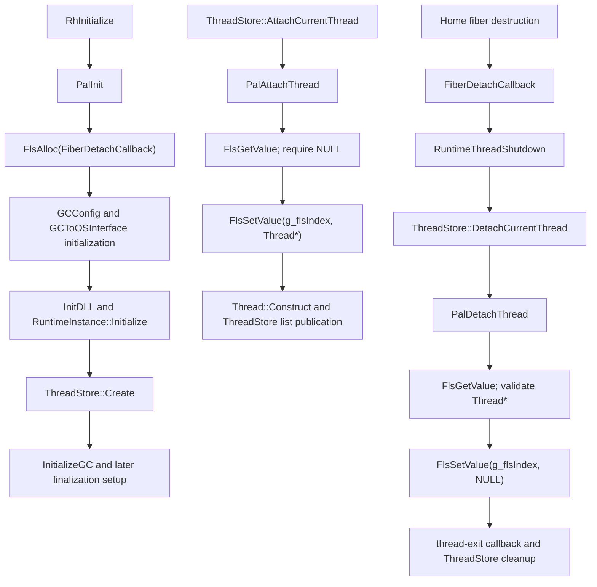

# NativeAOT GC Platform FLS Mapping

Status: the bounded dynamic local-storage prerequisite is implemented and
independently probed. NativeAOT `RhInitialize` remains intentionally gated.

## 1. Source-backed contract

The locked .NET 9.0 NativeAOT Workstation source uses one process-wide FLS
index, `g_flsIndex`, to associate the current fiber with the NativeAOT
`Thread*`. In `PalInit`, the index is allocated once with
`FlsAlloc(FiberDetachCallback)` before GC configuration, OS-interface, runtime,
or `ThreadStore` initialization. Allocation failure is the
`FLS_OUT_OF_INDEXES` sentinel.

The callback is exactly `void __stdcall FiberDetachCallback(void*)`. The
platform API also permits a null callback, but the locked NativeAOT source
passes this callback so fiber/thread destruction can reach
`RuntimeThreadShutdown`. The callback checks that its payload still equals the
current FLS value, then calls the runtime shutdown path for a non-null value.

The source checkout contains no `FlsFree` call for this index. That is distinct
from the Windows API contract: `FlsFree` releases an index and invokes its
callback for each fiber with a non-null value. The generic manager and inactive
adapter therefore prove release cleanup explicitly, but that release path is
not claimed as a call made by stock NativeAOT.

Source evidence:

* `out/dotnet/gc-feasibility-baseline/source-extract/src/coreclr/nativeaot/Runtime/windows/PalRedhawkMinWin.cpp:40-57,152-173`;
* `out/dotnet/gc-feasibility-baseline/source-extract/src/coreclr/nativeaot/Runtime/windows/PalRedhawkMinWin.cpp:176-224`;
* `out/dotnet/gc-feasibility-baseline/source-extract/src/coreclr/nativeaot/Runtime/startup.cpp:334-359`.

The platform semantics are also described by the official
[FlsAlloc](https://learn.microsoft.com/en-us/windows/win32/api/fibersapi/nf-fibersapi-flsalloc),
[FlsFree](https://learn.microsoft.com/en-us/windows/win32/api/fibersapi/nf-fibersapi-flsfree),
and
[PFLS_CALLBACK_FUNCTION](https://learn.microsoft.com/en-us/windows/win32/api/winnt/nc-winnt-pfls_callback_function)
documentation.

## 2. Exact source call flow



`ThreadStore::AttachCurrentThread` calls `PalAttachThread`, constructs the
thread, and publishes it in the `ThreadStore` list. `PalDetachThread` first
validates the FLS payload, clears it, and returns success; the subsequent
`ThreadStore::DetachCurrentThread` path runs the exit callback, removes the
thread from the list, releases GC-related thread state, and destroys the
thread. These operations are in
`nativeaot/Runtime/threadstore.cpp:106-154` and
`nativeaot/Runtime/windows/PalRedhawkMinWin.cpp:176-224`.

## 3. Mapping to guideXOS local storage

| Stock source requirement | Generic implementation/evidence |
| --- | --- |
| Dynamic index allocation | `allocateLocalStorageIndex`, bounded capacity 8 |
| Per-context get/set | `LocalStorageContext` with 8 pointer cells |
| Attach/detach | `attachLocalStorage`, `detachLocalStorage`, and TCB hooks |
| Detach callback | One staged pass after cells are cleared |
| Release cleanup | `releaseLocalStorageIndex` clears all registered contexts, calls callbacks, and advances the generation |
| Stale-handle protection | `{ slot, generation }` validation |
| NativeAOT-shaped API | `guidexos_nativeaot_fls_adapter.{h,cpp}` maps opaque handles to numeric adapter indexes |

The manager is runtime-neutral and does not add language-runtime fields to a
generic TCB. The existing fixed-index proof object in
`tools/dotnet/runtime-pack/src/platform/guidexos_nativeaot_platform.cpp` is a
separate compatibility path and remains unchanged.

## 4. Callback and release policy

For normal context detach, the manager scans dynamic slots in ascending slot
order, stages each callback-bearing non-null value, clears all cells, then
invokes the callbacks outside the hosted metadata lock. A callback that tries
to set a value during this window receives `Busy`; the detach result records
`CallbackFailed`. There is no repeated repopulation pass.

For index release, the manager performs the same clear-before-callback policy
across all registered contexts, bounded by the 32-context limit. It invokes the
registered callback once per non-null cell, invalidates the slot, and advances
the generation even when a callback failure is reported. A release callback
must not assume it is running on the original value owner. This gives the
inactive adapter deterministic release behavior without implying that stock
NativeAOT calls `FlsFree` during ordinary teardown.

## 5. Initial-thread behavior

The inactive adapter probe initializes the manager, attaches the initial thread,
allocates two indexes, and verifies set/get values before worker creation. The
initial values remain isolated from worker values and are cleared by explicit
detach. The bare-metal QEMU test performs the same bootstrap attach through
the platform hook.

## 6. Helper and worker behavior

The generic worker wrapper attaches before invoking an entry and detaches after
return. A newly attached worker starts with null values. The probe verifies
worker isolation and callback delivery; the QEMU test additionally exercises a
detached worker and waits for its callback before checking the initial context.
This is primitive lifecycle evidence, not proof that the stock NativeAOT
finalizer helper thread can start.

The locked source's finalizer path calls `PalStartFinalizerThread`, and
`FinalizerStart` calls `ThreadStore::AttachCurrentThread` before waiting. That
helper lifecycle remains downstream of the current startup gate:
`nativeaot/Runtime/FinalizerHelpers.cpp:38-43,68-85` and
`nativeaot/Runtime/windows/PalRedhawkMinWin.cpp:914-917`.

## 7. Inactive adapter probe

`runtime/tests/guidexos_nativeaot_fls_adapter_probe.cpp` calls the C adapter
entry points directly. It covers initial values, two-index allocation, worker
isolation, callback value/count, explicit detach, release callbacks,
generation-safe reuse, stale-index rejection, and shutdown. It contains no
`RhInitialize`, GC initialization, finalizer, or collection call and is not
linked into the live NativeAOT proof image.

## 8. Validation status

The FLS/local-storage row is PASS for the generic hosted tests, bare-metal
compile, opt-in QEMU guest, and inactive adapter probe. The final QEMU guest
also reports PASS for detached-thread cleanup, index-release callback,
process/runtime teardown, and leak check. The fixed-index proof path remains
separately compatible. No startup `entered` field changes: the readiness audit
still stops before `RhInitialize`.

## 9. Exact next blocker

This branch is Outcome B. The next mandatory blocker is:

```text
NativeAOT ThreadStore attachment and exact stack-bound PAL contract
```

`Thread::Construct` calls `PalGetMaximumStackBounds` and fail-fast handling is
required if the bounds cannot be reported; the source evidence is
`nativeaot/Runtime/thread.cpp:287-294`. The next experiment is to implement and
independently prove only current-thread `ThreadStore` registration,
stack-bound reporting, generation-safe teardown, and TCB reuse, then rerun the
full readiness gate. No NativeAOT startup-and-shutdown dry run is authorized by
the FLS result alone, and `RhInitialize` remains uncalled in this pass.
