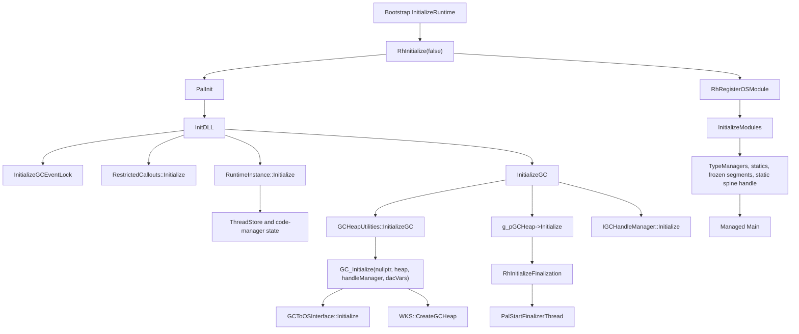

# NativeAOT Workstation GC Feasibility

Status: current 2026-07-22 readiness update; no garbage collection was enabled or executed. Outcome B remains current. Exact stack bounds, minimal ThreadStore attachment, generic VM lifecycle, raw-address registry, and true bare-metal QEMU VM evidence are complete. The one next mandatory blocker is exact stock Workstation GC `GCToOSInterface::Virtual*` binding/import elimination. See [NativeAOT GC-Owned Virtual Memory Boundary](NATIVEAOT_GC_OWNED_VIRTUAL_MEMORY.md), [NativeAOT GC Startup Readiness](NATIVEAOT_GC_STARTUP_READINESS.md), [NativeAOT ThreadStore Startup](NATIVEAOT_THREADSTORE_STARTUP.md), [Native Stack Bounds](../runtime/NATIVE_STACK_BOUNDS.md), and the machine report at `out/dotnet/gc-startup-dry-run/readiness/gc-startup-readiness.json`.

Date: 2026-07-19

## 1. Executive summary

The exact NativeAOT Workstation GC can be mapped reliably to the current AMD64 runtime pack. The archive is a complete linked-in Workstation collector object family, not an allocation-helper-only library, and its GC/EE interface identity matches the locked NativeAOT source. The source contains the normal initialization, synchronous collection, precise stack-map root enumeration, suspension, marking, reclamation, write-barrier, and handle-table paths.

The current guideXOS proof adapter deliberately stops before that surface. It provides a per-thread TLS block, a launch-scoped allocation context, and a fixed image-backed no-collection heap. The generic local-storage manager, exact stack-bound API, and inactive NativeAOT ThreadStore/FLS adapters now independently prove bounded lifecycle, per-thread values, generation-safe reuse, detach callbacks, exact initial/worker bounds, current-RSP validation, startup-safe registration, and teardown. The branch still does not provide the NativeAOT GC-owned virtual-memory interface or the later collector context/suspension services required by the stock runtime.

The recommended future mode is a separate opt-in Workstation-GC runtime-pack mode:

* one Workstation heap;
* synchronous, blocking explicit collection only;
* concurrent/background GC disabled in configuration;
* one application managed thread plus the finalizer helper thread that the matching NativeAOT startup unconditionally creates;
* no user-created managed threads, Tasks, thread pool, finalizable test objects, weak references, or exceptions in the first proof;
* GC-owned virtual-memory segments, not the current 64 KiB image-backed region.

The stock source does not support the requested “one managed thread and no finalizer thread” configuration without changing runtime/collector behavior: `InitializeGC` calls `RhInitializeFinalization`, which starts a finalizer thread. The collector itself does not need source modification for the bounded first collection, but the generic Server is missing several generally useful OS primitives.

**Decision: Outcome B — exact stack/ThreadStore readiness is complete, but the next NativeAOT startup prerequisite is missing.**

This pass stops at the platform contract and experiment design. It does not change allocation semantics, enter GC suspension, reclaim objects, or add a GC mode.

## 2. Current no-collection baseline

The current proof remains the control condition:

| Proof | Configuration | Result | Collection evidence |
| --- | --- | --- | --- |
| Non-allocating | normal managed entry, no managed allocation | two in-process launches and fresh process clean | no collection path entered |
| Single allocation | one `byte[256]` | clean, returned `0` | no collection path entered |
| Repeated allocation | 64 KiB image-backed heap | 234 objects, 280 bytes each, 16 bytes remaining, controlled OOM | `collectionEntered=0`, no expansion, pointer unchanged after OOM |
| Small repeated allocation | 4 KiB image-backed heap | 14 objects, 176 bytes remaining | same no-collection behavior |

The object contract is unchanged: `byte[]`, length 256, object size 280, alignment 8, data at `+0x10`. The allocation path remains:

```text
ManagedMain -> RhpNewArray -> guideXosStockRhpNewArray -> RhpNewFast
```

The preserved evidence directory is [out/dotnet/gc-feasibility-baseline](../../out/dotnet/gc-feasibility-baseline/). It contains the clean runtime-pack build, proof logs, fresh-process replay, bounded replays, archive member lists, source extraction, manifests, maps, PE import reports, and toolchain provenance.

The bounded current stability run was three single-allocation replays (`0, 0, 0`), two repeated-allocation replays (`0, 0`), and a separate Server process running the two-launch repeated proof. Every repeated proof retained `collectionEntered=0`. No generated runtime binary is intended to be tracked and the default application inventory was not modified.

## 3. Exact GC source and runtime identity

The authoritative identity is `tools/dotnet/runtime-pack/runtime-pack.lock.json`:

| Item | Locked or observed value |
| --- | --- |
| Architecture | AMD64 / `win-x64` |
| Target framework | `net9.0` |
| ILCompiler/runtime pack | `9.0.0` |
| NativeAOT source commit | `9d5a6a9aa463d6d10b0b0ba6d5982cc82f363dc3` |
| Source checkout/object database | `out/dotnet/gc-feasibility-baseline/nativeaot-runtime` |
| Exact source extraction | `out/dotnet/gc-feasibility-baseline/source-extract` |
| Stock package root | `C:\Users\guideX\.nuget\packages\runtime.win-x64.microsoft.dotnet.ilcompiler\9.0.0` |
| Stock `Runtime.WorkstationGC.lib` | 5,802,942 bytes; SHA256 `0E6A134AD4150CD604317A47860DAE82EB30AAE4D9CDB14144E06454E7BB1948` |
| Build compiler | MSVC `19.51.36248` for x64 |
| Build linker | MSVC linker `14.51.36248.0`; PE reports major/minor `14.51` |
| Observed .NET SDK | `10.0.302`, commit `35b593bebf`; the lock records approved SDK `10.0.301` / `96856fd726` |
| Runtime-pack build | Release-style `/O2 /Oi /Brepro`, `/GS-`, `/GR-`, `/EHs-c-`, AMD64 `vcvars64`, custom platform object plus stock managed assemblies and GC library |

The full source checkout hit Windows path-length limits during ordinary checkout. The requested commit is present and verified in the checkout's Git object database; the analysis used `git show` at that commit and extracted the exact relevant files. The lock, package version, archive member paths, and source tree agree on the NativeAOT generation.

The matching GC headers report:

```text
GC_INTERFACE_MAJOR_VERSION 5
GC_INTERFACE_MINOR_VERSION 3
EE_INTERFACE_MAJOR_VERSION 2
```

No separate EE minor-version macro is present. This is a linked-in GC, not a standalone DLL protocol at runtime: `gcheaputilities.cpp` calls `GC_Initialize(nullptr, &heap, &manager, &g_gc_dac_vars)` directly.

The relevant CMake configuration defines `FEATURE_NATIVEAOT`, `NATIVEAOT`, `FEATURE_HIJACK`, Windows `FEATURE_SUSPEND_REDIRECTION`, `FEATURE_BASICFREEZE`, `FEATURE_CONSERVATIVE_GC`, `FEATURE_USE_SOFTWARE_WRITE_WATCH_FOR_GC_HEAP`, `FEATURE_MANUALLY_MANAGED_CARD_BUNDLES`, `FEATURE_CUSTOM_IMPORTS`, `FEATURE_DYNAMIC_CODE`, `FEATURE_CACHED_INTERFACE_DISPATCH`, and Windows event features. The archive is the Workstation target; Server GC would add `FEATURE_SVR_GC` and server-specific objects, which are not present.

The stock archive has 64 members covering the runtime, collector, handle tables, PAL, minipal, and AMD64 helpers. The complete inventory is preserved in [stock-runtime-workstationgc-members.txt](../../out/dotnet/gc-feasibility-baseline/stock-runtime-workstationgc-members.txt). Functional groups are:

```text
Runtime: allocheap, Crst, events, EHHelpers, FinalizerHelpers, GcEnum, GCHelpers,
         gctoclreventsink, gcheaputilities, GCMemoryHelpers, gcenv.ee, MethodTable,
         RuntimeInstance, StackFrameIterator, startup, thread, threadstore,
         TypeManager, UniversalTransitionHelpers, RestrictedCallouts, SyncClean,
         stressLog, yieldprocessornormalized, and related helpers.
GC:     gceventstatus, gcload, gcconfig, gccommon, gceewks, gcwks, gcscan,
        gchandletable, handletable/cache/core/scan, objecthandle,
        softwarewritewatch.
PAL:    PalRedhawkCommon, PalRedhawkMinWin, gcenv.windows, minipal time/cpufeatures.
AMD64:  AllocFast, ExceptionHandling, GcProbe, MiscStubs, PInvoke,
        InteropThunksHelpers, StubDispatch, UniversalTransition, WriteBarriers,
        AsmOffsetsVerify, ThunksMapping, CoffNativeCodeManager.
```

The adapted archive is a complete Workstation family with controlled substitutions:

| Adaptation | Non-repeated pack | Repeated proof pack |
| --- | --- | --- |
| Removed stock members | `EHHelpers.cpp.obj`, `thread.cpp.obj` | same, plus `amd64/AllocFast.asm.obj` |
| Renamed stock exports | reverse-P/Invoke and fallback fail-fast exports | same |
| GuideXOS allocation export | not bound | stock `RhpNewArray` renamed to `guideXosStockRhpNewArray` |
| Adapted library hash | `F1441743A5F303672FA1A3437DB5B1CC2D087F2B41F8FCF7EAB076DBC646F44F` | `969CC55193A1194F3581A8A3C463C6AAA19C4BE58333F635F6AB83B701EAF680` |
| Platform object hash | `DA2471B53E2051D5F656860E968D4761F955AABB0501618F453B86FD8ADFC509` | `C4A926BE01765C9E6F77DF65BB31344C3A43750B011964A5CDF42517E883C265` |

## 4. Adapted GC library contents

The archive contains `WKS::CreateGCHeap`, `GCHeap::Initialize`, `GCHeap::GarbageCollect`, `GarbageCollectTry`, `GarbageCollectGeneration`, root scanning, marking, sweeping, relocation/compaction, handle tables, finalization support, allocation contexts, write barriers, the NativeAOT EE adapter, and the Windows GC PAL.

It does not contain the Server GC source family: there is no `gcsvr.cpp`/Server heap member and no `FEATURE_SVR_GC` Workstation archive identity. The library name is not being used as capability evidence; the member list and exact source CMake files are.

The current guideXOS platform object substitutes only the proof boundary. It provides the fixed TLS layout, app-scoped runtime cell, local FLS cells, reverse-P/Invoke frame-link storage, fail-fast diagnostics, and, in allocation modes, the image-backed allocator. It does not substitute `GCToOSInterface`, `ThreadStore`, `GCToEEInterface`, or the stock runtime thread object.

## 5. GC initialization call flow

Normal NativeAOT startup has this order:



`RhInitialize` initializes PAL/runtime/GC state before `RhRegisterOSModule`. `RuntimeInstance::Initialize` and `ThreadStore` state precede GC initialization. OS module/type-manager registration follows GC initialization but must precede trustworthy managed root enumeration because code managers, static regions, frozen segments, and the module GC-static spine must be published. The current reverse-P/Invoke adapter does not attach a stock `Thread` through `ThreadStore::AttachCurrentThread`; that is a future opt-in-mode requirement.

`GC_Initialize` receives `IGCToCLR*` (null for this linked-in path), and out-parameters for `IGCHeap*`, `IGCHandleManager*`, and `GcDacVars*`. `GCToOSInterface::Initialize` discovers page size/allocation granularity, processor information, optional NUMA/CPU groups, and policy. `GCHeap::Initialize` creates segment/generation state and synchronization objects.

`RhInitializeFinalization` is not optional in this source path. It creates finalization events and calls `PalStartFinalizerThread`; the thread attaches to `ThreadStore` and waits. Initialization allocates native state through `new`, `VirtualAlloc`-based helpers, events, critical sections, GC segments, handle-table state, and the finalizer thread. The current image-backed heap and TLS block are not enough.

## 6. Explicit collection call flow

The exact no-argument managed path is:

```text
System.Private.CoreLib GC.NativeAot.cs
  GC.Collect()
    -> RuntimeImports.RhCollect(-1, InternalGCCollectionMode.Blocking)
      -> Runtime.Base InternalCalls.cs [RuntimeExport("RhCollect")]
        -> RhpCollect(-1, Blocking, FALSE)
          -> ThreadStore::GetCurrentThread()
          -> Thread::DeferTransitionFrame()
          -> Thread::DisablePreemptiveMode()
          -> IGCHeap::GarbageCollect(-1, false, collection_blocking)
             -> GCHeap::GarbageCollect
             -> GarbageCollectTry
             -> GarbageCollectGeneration
             -> GCToEEInterface::SuspendEE
             -> ThreadStore::SuspendAllThreads
             -> GCToEEInterface::GcScanRoots
             -> precise stack-map/handle/static-root scanning
             -> mark, sweep, and any required relocation/compaction
             -> GCToEEInterface::RestartEE
             -> ThreadStore::ResumeAllThreads
          -> Thread::EnablePreemptiveMode()
```

The relevant source files are `nativeaot/System.Private.CoreLib/src/System/GC.NativeAot.cs`, `nativeaot/System.Private.CoreLib/src/System/Runtime/RuntimeImports.cs`, `nativeaot/Runtime.Base/src/System/Runtime/InternalCalls.cs`, `nativeaot/Runtime/GCHelpers.cpp`, `Runtime/threadstore.cpp`, `Runtime/gcenv.ee.cpp`, and GC `gc.cpp`/`gcwks.cpp`.

`GC.Collect()` with no arguments does not itself validate user arguments or create a managed exception path. Overloads with generation/mode/blocking/compacting arguments validate and can throw; they are excluded from the first proof. `GC.CollectionCount` calls `RhGetGcCollectionCount`. `GC.GetTotalMemory(false)` calls `RhGetGcTotalMemory`, whose native path reports `IGCHeap::GetTotalBytesInUse`; these are suitable future measurements.

The first collection still reaches synchronization, timing/statistics, finalization queue checks, handle scanning, write-barrier state, and native failure/assertion paths. No managed exception recovery should be assumed.

## 7. Minimum platform capability matrix

Classification: `A` already correct; `B` existing guideXOS facility can be adapted; `C` new bounded platform implementation; `D` not required for the first primitive-array collection; `U` not yet proven.

| Requirement | NativeAOT symbol/source | Current guideXOS support | Needed for first collection? | Proposed implementation | Class |
| --- | --- | --- | --- | --- | --- |
| Page size/granularity | `GCToOSInterface::Initialize`, `GetSystemInfo` | no GC PAL surface | yes | bounded one-node/one-group query | C |
| Reserve/commit | `VirtualReserve`, `VirtualCommit` | `ExecutableMemory` has combined reserve/commit only | yes | runtime-pack GC PAL with reserved segments | B/C |
| Decommit/release | `VirtualDecommit`, `VirtualRelease` | no general Server wrapper | safe lifecycle | GC PAL wrappers | C |
| Reset/discard | `VirtualReset` | no | no | leave disabled until proven | D |
| Protection/address query | `PalVirtualProtect`, `PalGetMaximumStackBounds`/`VirtualQuery` | protection exists; stack query does not | stack query yes | reuse protection; add bounded stack query | B/C |
| Large pages | `VirtualReserveAndCommitLargePages` | no | no | disable `GCLargePages` | D |
| Write-watch | `SupportsWriteWatch`, `GetWriteWatch` | no | no with sync WKS/no BGC, verify | leave stock path intact but unreachable | D/U |
| NUMA/CPU groups | `InitNumaNodeInfo`, `InitCPUGroupInfo` | no GC support | discovery in init; multi-node no | report one node/group | C/D |
| Current thread identity | `PalGetCurrentOSThreadId` | host IDs only | yes | expose through PAL | B |
| Thread creation | `PalStartFinalizerThread` | no generic primitive | yes: finalizer | isolated thread start plus runtime attach | C |
| Suspension/resume | `PalSuspendEE`, `SuspendThread`, `ResumeThread` | no GC-safe service | helper thread | bounded AMD64 context/suspension PAL | C |
| Context capture | `PalGetThreadContext`, `RtlCaptureContext` | no GC-safe service | suspension/hijack | AMD64 context adapter | C |
| Stack bounds | `PalGetMaximumStackBounds` | exact generic PAL plus inactive ThreadStore record | yes | `VirtualQuery`/TEB or explicit bounds | B/C |
| TLS/FLS | `PalInit`, `PalAttachThread`, `PalDetachThread` | proof TLS/local FLS exists | yes | adapt TLS to FLS slot/lifetime semantics | B/C |
| Cooperative/preemptive state | `Thread`, `ThreadStore`, transition helpers | inactive record starts preemptive with transition sentinels | yes | register real `Thread` and frame | B/C |
| Thread-store enumeration | `AttachCurrentThread`, `FOREACH_THREAD` | bounded startup-safe registry only | yes for startup; no collection safety claim | use stock `ThreadStore` only for managed threads | B/C |
| Safe-point/trap/hijack | `RhpTrapThreads`, `Thread::Hijack`, `RhpGcProbe` | no GC trap integration | helper suspension | preserve stock helpers; provide PAL | C |
| Events | `GCEvent`, `PalCreateEventW`, `SetEvent`, `ResetEvent` | no general event abstraction | yes | bounded auto/manual event wrapper | C |
| Wait-one/wait-many/timeouts | `GCEvent::Wait`, PAL wait APIs | only isolated host use | yes | finite timeout/alertability wrapper | C |
| Critical sections | `CLRCriticalSection`, `Crst` | no GC init path | yes | isolated lifecycle wrapper | B/C |
| Atomics/barriers | thread-store/GC atomics, `PalFlushProcessWriteBuffers` | compiler atomics only | yes | stock AMD64 ordering and narrow flush | B/C |
| Timing | QPC/frequency, tick count | proof image imports timing | statistics/timeouts | route existing timing into PAL | B |
| Sleep/yield | `GCToOSInterface::Sleep`, `PalSwitchToThread` | no GC wrapper | suspension retry | narrow wrapper | B/C |
| Fail-fast/assertions | `RhFailFast`, `RaiseFailFastException` | guideXOS fail-fast exists | fatal paths | preserve diagnostics and map failure | B |
| Module/type managers | `RhRegisterOSModule`, `InitializeModules` | proof hydrates selected metadata | yes | normal NativeAOT startup | C |
| Static/frozen roots | `RhRegisterFrozenSegment`, static spine handle | absent in proof | yes | stock startup and barriers | C |
| Precise stack roots | `Thread::GcScanRootsWorker`, `StackFrameIterator`, `CoffNativeCodeManager` | metadata exists; thread missing | yes | preserve stack maps/frame/bounds | B/C |
| Handles/interior/pinned roots | `IGCHandleManager`, `GCFrameRegistration`, `EnumGcRef` | no manager live | runtime statics | stock handle manager; simple user roots | C |
| Allocation contexts | `allocheap.cpp`, `GC_ALLOC_CONTEXT` | custom context is no-collection only | yes | collector-owned contexts | C |
| Write barriers/card table | `StompWriteBarrier`, `g_card_table`, `WriteBarriers.asm` | globals not initialized | mandatory setup | initialize stock globals | C |

The result is finite, not small: the collector is usable as-is, but the required PAL/runtime boundary is larger than the current proof adapter.

## 8. Windows dependency inventory

### Virtual-memory primitive status

The runtime-neutral region lifecycle and inactive NativeAOT platform mapping
are documented in [NATIVEAOT_GC_PLATFORM_VIRTUAL_MEMORY.md](NATIVEAOT_GC_PLATFORM_VIRTUAL_MEMORY.md).
The hosted lifecycle, true bare-metal QEMU lifecycle, and adapter probe pass;
GC initialization remains disabled because the broader thread, event, FLS,
stack, and collector-startup contracts are still outside this VM pass.

### Critical-section primitive status

The runtime-neutral mutex, single-CPU scheduler integration, inactive recursive
NativeAOT critical-section adapter, hosted probe, and AMD64 QEMU validation are
documented in [NATIVEAOT_GC_PLATFORM_CRITICAL_SECTIONS.md](NATIVEAOT_GC_PLATFORM_CRITICAL_SECTIONS.md).
This closes the generic critical-section primitive experiment only; it does not
claim that the complete Workstation GC startup contract is live.

The static library has no PE import table. The current proof PE import report is reachability evidence for the adapted non-collecting link; NativeAOT source and selected archive members identify imports that become live when initialization or collection is enabled.

| API/family | Static source | Current proof PE | Initialization | First collection | Optional/dead in recommended mode | Handling |
| --- | --- | --- | --- | --- | --- | --- |
| `FlsAlloc`, `FlsGetValue`, `FlsSetValue` (`FlsFree` not referenced) | `PalRedhawkMinWin.cpp` | Fixed proof cells remain; bounded generic manager and inactive adapter now pass | live | live for attached threads | index release is not on the matched source path | generic manager plus NativeAOT-shaped adapter; stock startup still gated |
| `VirtualAlloc`, `VirtualFree` | `gcenv.windows.cpp` | present | live for GC segments | live for commit/expansion | none | separate GC PAL; not image heap |
| `VirtualQuery` | `PalRedhawkCommon.cpp` | present | live for stack bounds | live if query path used | none | bounded stack query/registered bounds |
| `VirtualProtect` | `PalRedhawkMinWin.cpp` | not observed in current proof list | setup-dependent | not central | likely optional | use through PAL only |
| `VirtualAllocExNuma` and NUMA APIs | `gcenv.windows.cpp` | absent | if enabled | no for one-node | yes | force one node/group |
| large-page privilege APIs | `gcenv.windows.cpp` | absent | no | no | yes | keep disabled |
| write-watch APIs | `gcenv.windows.cpp` | absent | no in sync/no-BGC mode unless selected | no | yes | do not remove; prove unreachable |
| `CreateEvent`/`CreateEventExW`, `SetEvent`, `ResetEvent`, `CloseHandle` | `event.cpp`, GC PAL, finalizer helpers | Create/set/close are present; Reset not observed | finalizer/GC events | waits/resume | required events not optional | isolated auto/manual event wrapper |
| `WaitForSingleObjectEx`, `WaitForMultipleObjectsEx` | PAL/`GCEvent` | wait-many present | finalizer/helper waits | GC waits | no | wait-one/wait-many with timeout |
| `CreateThread` | finalizer PAL | absent | required by finalizer | helper exists | background/eventpipe disabled | only finalizer start path |
| current process/thread/ID and duplication | `Thread::Construct`, PAL | several current APIs present | thread registration | context/suspension | no | route to PAL; exclude native Server threads |
| `SuspendThread`, `ResumeThread` | `PalRedhawkMinWin.cpp` | present | not necessarily | relevant to helper/hijack | only if cooperative proof eliminates | preserve exact context protocol |
| `GetThreadContext`, `SetThreadContext`, XState APIs | PAL | partly present | no | context/hijack | optional only after proof | do not delete source imports |
| `RtlCaptureContext`, `RtlRestoreContext` | PAL/stack iterator | present | no | context walking | no until self-collect proven | ABI-compatible AMD64 implementation |
| QPC/frequency/ticks | GC PAL | present | configuration/statistics | GC timing | no | preserve current timing imports |
| `Sleep`, `SwitchToThread` | GC PAL/thread-store | present | no | suspension retry | no | narrow wrappers |
| critical-section APIs | `Crst.cpp`, `gcenv.windows.cpp` | enter/leave present; lifecycle unproven | GC locks | GC locks | no | initialize/destroy in PAL |
| `RaiseFailFastException` | runtime fail-fast | present | fatal only | fatal only | no | retain diagnostics |
| ETW/event-source APIs | runtime eventing | ADVAPI32 registration/report present | optional | optional | yes | leave linked behavior unchanged |
| `CoGetApartmentType`/`CoWaitForMultipleHandles` | PAL compatibility waits | COM wait present | only COM path | not needed without COM | yes | direct waits for bounded mode |
| CRT heap `malloc/free` | runtime helpers | present | native helper state | native helper state | not collector heap | do not confuse native and managed ownership |

The current proof image does not link the stock NativeAOT FLS allocator or prove that `CreateThread`/ThreadStore startup is reachable. The inactive adapter probe is separate evidence for the bounded FLS contract; it is not evidence that GC initialization works. The proof image imports VM allocation/query, timing, events/waits, context functions, critical-section entry/leave, and fail-fast only at its existing no-collection boundary.

## 9. Recommended GC mode

### Candidate A — one managed thread, no helper/finalizer thread

Rejected for the stock source. `RhInitializeFinalization` is called unconditionally from `InitializeGC` and calls `PalStartFinalizerThread`. Removing it would be a runtime-source change.

### Candidate B — Workstation GC with the required helper thread

Recommended: one Workstation heap, no Server-GC objects, blocking explicit collection only, concurrent/background collection disabled, and one idle finalizer helper thread. There must be no user-created managed threads, Tasks, thread pool, or managed callbacks on unrelated Server workers.

The matching `gcconfig.h` defaults `gcConcurrent=true`, so future initialization must explicitly set it false before heap startup. `gcServer` and NUMA/CPU-group behavior must be false/one-node. The source CMake configuration and final compiler response must be checked for background-GC defines rather than assuming the public API is synchronous.

### Candidate C — collector-source reduction

Not currently required. No ABI mismatch or collector algorithm defect was found. Do not modify collection algorithms to avoid PAL work.

## 10. Root-enumeration requirements

The matching runtime has a precise path: `RuntimeInstance` registers code/type managers; `Thread::GcScanRoots` builds a `StackFrameIterator` from the transition frame; `GcScanRootsWorker` calls `EnumGcRefs` using generated GC-info/stack-map metadata; register-return roots, transition frames, exception-info roots, `GCFrameRegistration` roots, interior references, and pinned/byref kinds are handled; `GCToEEInterface::GcScanRoots` enumerates each attached `Thread`; and `InitializeModules` registers static bases/frozen segments and a normal GC handle for the module static spine.

Conservative scanning is not the first-proof design. The source has a conservative fallback for configured/unknown-signature cases, but `gcConservative` defaults false. Keep it false and use generated stack maps.

The current guideXOS trampoline preserves the AMD64 reverse-P/Invoke ABI and a proof frame link, but the inactive adapter does not create a stock `Thread`, install stock `PInvokeTransitionFrame` state, or register the current thread in the live `ThreadStore` startup path. The new bounded record proves only startup-scoped attach/lookup/detach and exact stack facts; it cannot yet prove that retained `A` would be found by a real collection. The future test should keep `A` as a local used after collection and followed by `GC.KeepAlive(A)`, while temporary arrays are created in a helper scope that returns no reference.

## 11. Thread-suspension requirements

`RhpCollect` defers the transition frame and disables preemptive mode before `IGCHeap::GarbageCollect`. The collecting thread is the current/suspending thread. `ThreadStore::SuspendAllThreads` skips that thread and loops over other attached runtime threads; `ResumeAllThreads` resets cached transition frames and releases the trap state.

The honest minimum policy is exactly one application `Thread` plus the runtime-created finalizer `Thread`, no user-created managed threads/Tasks/thread pool, and no unrelated native Server thread attached to `ThreadStore`. The finalizer thread must be initialized and idle before collection. Its transition/stack state must be safely quiescent or captured by the stock suspension path. Native host threads remain outside the managed thread store.

## 12. Write-barrier and card-table requirements

Primitive `byte[]` user writes do not store managed references, so they avoid user write-barrier traffic. A local reference to `A` needs no barrier. The barrier surface is nevertheless mandatory: `StompWriteBarrier`, `g_card_table`, `g_lowest_address`, `g_highest_address`, `g_ephemeral_low/high`, software-write-watch/card-bundle globals, and generated module/static initialization all depend on collector setup. `InitializeModules` writes the module GC-static spine through barrier-aware paths. A future reference array would broaden requirements and is excluded.

## 13. Heap and virtual-memory requirements

The current 64 KiB image-backed heap cannot be adopted through a supported stock interface. It has no segment/generation metadata, reserve/commit/decommit/release contract, collector allocation contexts, card-table range, or safe GC teardown. It intentionally forbids collection and pointer movement.

Stock Workstation GC owns its segments through `GCToOSInterface`, expects Windows allocation-granularity/alignment rules, and owns generation boundaries. A 64 KiB proof region is not a normal Workstation segment. Recommended strategy is **B — a separate GC-managed heap mode**: the future opt-in mode replaces the allocator with collector-owned segments while all existing no-collection modes remain unchanged. A later hard limit may be evaluated through GC configuration; the image-backed bound must not be forced onto stock GC. Fresh-process repeat comes before same-process teardown/repeat.

## 14. Synchronization and timing requirements

The first collection needs auto/manual events, wait-one/wait-many and timeouts, critical sections, AMD64 atomics/memory barriers, QPC/frequency/ticks, sleep/yield, and native fail-fast/logging. Semaphores, mutexes, condition variables, thread pool scheduling, GUI synchronization, and broad wait-registration are not required unless reachability proves otherwise; they remain `D`, not successful stubs.

## 15. guideXOS C# reuse findings

The old `guideXOS`/`guideXOSUEFI` C# runtime audit was reviewed. It uses an old NativeAOT-era ILCompiler package (`7.0.0-alpha.1.22074.1`), bare-metal boot assumptions, manual `malloc`/`free` allocation, and several no-op/fail-fast runtime hooks.

| Legacy finding | Classification | Use here |
| --- | --- | --- |
| PE-to-ELF staging and symbol-driven entry selection | C — design/reference | packaging/bootstrap reference |
| module/static initialization concepts | C — design/reference | shape reference only; use matching 9.0 source |
| manual `malloc`/zeroed array allocator | D — unsafe/incompatible | not a tracing GC |
| explicit object `free`/`Dispose` | D — unsafe/incompatible | conflicts with managed reachability/movement |
| empty reverse-P/Invoke/P/Invoke hooks | D — unsafe/incompatible | no transition/root contract |
| thread identity/FLS stubs and no-op monitor | D — unsafe/incompatible | unusable for ThreadStore/GC locks |
| old EEType/object-layout copies | D — unsafe/incompatible | runtime-generation/ABI mismatch |
| finalizer shape without a traced queue | U — unknown | do not reuse |
| bootloader/kernel/framebuffer/filesystem/network code | D — unsafe/incompatible | outside Server scope |

No .NET 7/runtime-generation implementation should be copied into the current pack.

## 16. Current Server capability comparison

| Capability | Current Server/adapter | GC consequence |
| --- | --- | --- |
| AMD64 TLS block | proven 0x110-byte proof envelope | starting point; needs stock FLS lifetime |
| indexed FLS-like cells | eight local cells | not equivalent to FLS allocation/detach |
| executable memory | combined reserve/commit/protect/release | not GC segment/decommit/reset policy |
| native host threads | present | must remain outside ThreadStore |
| managed thread registration | inactive minimal ThreadStore adapter | required for live startup |
| event/wait abstraction | no general GC primitive | missing generic primitive |
| context capture/suspension | no managed-GC service | missing generic primitive |
| stack bounds | exact generic PAL + inactive ThreadStore record | required for live startup |
| module/static registration | proof hydration only | normal startup required |
| fixed image heap | proven no-collection | preserve; do not pass to stock GC |
| default inventory | unchanged | must remain unchanged |

This comparison supports Outcome B: the runtime/source design is sound, exact
stack/ThreadStore attachment is now proven outside startup, and the next
mandatory live-startup capability is the GC-owned virtual-memory PAL.

## 17. Transient `0xC0000409` status

Historical `0xC0000409` remains incompletely diagnosed. Diagnostics stayed enabled and no fail-fast probe was suppressed. The current bounded validation did not reproduce it: three single-allocation replays, two repeated-allocation replays, and a fresh Server process running the repeated proof all passed, with `collectionEntered=0` in repeated runs.

Required status: **reproduced historically but still unresolved; not reproduced during bounded GC-feasibility validation**. This is sufficient for source mapping but not for declaring all hosted lifecycle failures diagnosed. It does not reach Outcome E because it did not recur and is not on the real-GC path.

## 18. First real-collection experiment design

Future design only; do not add it during this pass.

1. Record `GC.CollectionCount(0..2)` and `GC.GetTotalMemory(false)`.
2. Allocate retained `A = new byte[256]` and write a fixed nonzero pattern to all 256 bytes.
3. In a helper method allocate 128 temporary `byte[256]` arrays, write a distinct byte to each, and return without retaining any reference.
4. Record pre-collection bytes and counts.
5. Call no-argument `GC.Collect()` exactly once. Do not use `GetTotalMemory(true)`, because it may collect/finalize repeatedly.
6. Validate every byte in `A`, call `GC.KeepAlive(A)`, and record counts/bytes again.
7. Allocate and validate `B = new byte[256]`, record bytes again, and return 0.

Expected evidence: one collection-count increase; unchanged `A`; a measurable decrease in `GetTotalMemory(false)`/`IGCHeap::GetTotalBytesInUse` corresponding to the temporary footprint; successful `B` allocation; and collector-owned segment/used counters showing reclamation rather than the old image heap. If managed accounting is too coarse, add proof-only diagnostics for `GetTotalBytesInUse`, `GetTotalAllocatedBytes`, and generation/segment counters; do not add a public .NET type. Fresh-process repeat is mandatory. Allocation-after-collection alone is not sufficient.

## 19. Ordered implementation milestones

| Order | Milestone | Likely files | Test/failure focus | Generic Server change? |
| --- | --- | --- | --- | --- |
| 1 | Freeze source/ABI manifests and GC surface report | lock/build/scripts | wrong source or renamed ABI | no |
| 2 | Isolated page/segment memory PAL | runtime-pack `src/platform/*` | granularity, guard, decommit, leaks | possibly VM primitive |
| 3 | Event/wait/critical-section/timing PAL | runtime-pack platform | timeout, reset, lost signal, deadlock | yes for reusable event |
| 4 | FLS lifetime and exact stack bounds | runtime-pack platform/entry | stale TLS, wrong thread, bad bounds | PASS in inactive adapters |
| 5 | Attach app thread to minimal ThreadStore | runtime-pack platform/entry | missing thread/frame/teardown | PASS in inactive adapter |
| 6 | GC-owned reserve/commit/decommit/release PAL | runtime-pack platform | granularity, guard, decommit, leaks | next blocker |
| 7 | Event/wait/critical-section/timing PAL integration | runtime-pack platform | timeout, reset, lost signal, deadlock | downstream of VM PAL |
| 8 | Normal module/type/frozen/static startup | runtime-pack startup/bootstrap | roots before registration | runtime-pack-local |
| 9 | One-heap WKS initialization, concurrent/background off | runtime-pack config/PAL | finalizer/VM/init failure | thread primitive may be needed |
| 10 | Collector allocation contexts and barriers | runtime-pack allocator binding | object layout/context/card globals | runtime-pack-local |
| 11 | Primitive-array precise-root validation | managed proof/runtime diagnostics | missed stack/static roots | runtime-pack-local |
| 12 | One synchronous collection | managed proof and diagnostics | suspension deadlock, missed A | no new surface if prior work works |
| 13 | Reclaim/reuse and fresh repeat | proof/scripts | bytes/count/A/B/teardown | no |

No milestone requires changing generic Server allocation, inventory, compositor, VFS, desktop, or normal launch.

## 20. Merge and modularity risks

Do not turn the proof-specific runtime pack into a process-wide GC contract. Select GC mode by runtime-pack identity/manifest; preserve the current image-backed allocator for all no-collection proofs. Do not attach unrelated Server native threads, enable the default `gcConcurrent=true`, assume primitive arrays remove static/card initialization, or copy old C# runtime internals. Do not scatter GC behavior through `native_elf_executor.cpp`, generic App Model code, VFS, compositor, desktop, or normal launch.

## 21. Exact files likely required

Likely runtime-pack-local files:

```text
tools/dotnet/runtime-pack/src/platform/guidexos_nativeaot_platform.cpp
tools/dotnet/runtime-pack/build-runtime-pack.ps1
tools/dotnet/runtime-pack/runtime-pack.lock.json
tools/dotnet/runtime-pack/README.md
scripts/dotnet/build-guidexos-nativeaot-runtime-pack.ps1
scripts/dotnet/stage-managed-hostlog-proof.ps1
scripts/dotnet/*gc*surface*.ps1
samples/managed/HostLogProof/Program.cs              (future experiment only)
samples/managed/HostLogProof/runtime_support.c      (future diagnostics only)
```

If the platform object becomes too broad, add a separate runtime-pack-local `guidexos_nativeaot_workstation_gc_platform.cpp`. A generic event, VM, or context primitive belongs in an isolated reusable module and must be proved independently before the runtime pack consumes it.

## 22. Files that must remain untouched

Unless a separately justified generic primitive is being added, the future GC work must not modify:

```text
native_elf_executor.cpp
native_elf_launch_pipeline.cpp
native_elf_image_loader.cpp
native_app_runtime.cpp
app_registry.cpp / app_manifest_loader.cpp / app_launch_resolver.cpp
server.cpp and normal/experimental application inventory files
VFS, compositor, desktop, GUI, networking, filesystem, and generic Server allocators
```

This pass changed none of those files and did not add a public runtime type or a collection stub.

## 23. Decision outcome

**Outcome B — Feasible, with exact stack/ThreadStore readiness complete and one next live-startup blocker.**

The exact source and binary identity is established. The linked Workstation GC has a finite, understandable platform surface, a valid one-heap synchronous configuration (with the mandatory finalizer helper), and precise NativeAOT root enumeration. The bounded FLS lifecycle, exact initial/worker stack bounds, and minimal ThreadStore attachment/lookup/detach lifecycle are independently proven in inactive adapters. The single next mandatory blocker is GC-owned virtual-memory PAL integration; later event, module, finalizer, handle, barrier, and collection-safe suspension work remains downstream. No collector-source fork is justified by this audit. No collection was entered and the current no-collection allocator remains the only active allocation implementation.

## 24. Historical exact next experiment (2026-07-19)

Following the Outcome B rule, implement and prove the one next NativeAOT-specific prerequisite: GC-owned virtual-memory PAL integration for reserve, commit, decommit, release, page/granularity, and timing behavior. Keep it outside the live GC startup path and preserve the exact stack/ThreadStore evidence.

After that native primitive passes, implement only the bounded GC platform-memory and single-thread/event layer required to reach Workstation GC initialization, still without triggering collection. The first real collection remains the section 18 experiment and must wait for initialization-only diagnostics proving the thread store, finalizer helper, module registration, stack bounds, allocation contexts, card-table globals, and GC-owned segments are internally consistent.

Implementation status: the generic hosted/bare-metal event, mutex, VM, thread,
and local-storage primitives and their inactive NativeAOT probes are available.
The final local-storage QEMU run passed detached-thread cleanup, release
callbacks, process/runtime teardown, and leak checks; the final mutex QEMU run
passed the guest marker and anchored runner parser. These results remain
primitive evidence and do not authorize live GC startup.
See [Native local storage](../runtime/NATIVE_LOCAL_STORAGE.md),
[NativeAOT GC Platform FLS](NATIVEAOT_GC_PLATFORM_FLS.md),
[NativeAOT ThreadStore Startup](NATIVEAOT_THREADSTORE_STARTUP.md),
[Native Stack Bounds](../runtime/NATIVE_STACK_BOUNDS.md), and the existing
event/VM/thread platform documents. No GC initialization or collection was
added in this pass. See the current
[NativeAOT GC Platform Threads](NATIVEAOT_GC_PLATFORM_THREADS.md) status for
the inactive helper-thread boundary.

Current 2026-07-22 evidence supersedes the older VM blocker wording: the
generic VM, raw-address registry, hosted adapter probe, and true bare-metal
QEMU adapter probe pass. The current single blocker is exact stock
Workstation GC `GCToOSInterface::Virtual*` binding/import elimination, as
documented in [NativeAOT GC-Owned Virtual Memory Boundary](NATIVEAOT_GC_OWNED_VIRTUAL_MEMORY.md).

## 25. Current readiness status

The gated 2026-07-19 readiness audit stopped before `RhInitialize`: dynamic
FLS/local-storage, exact stack bounds, and minimal ThreadStore attachment now
pass, and the one next blocker is NativeAOT GC-owned virtual-memory PAL
integration. No live startup or GC dry-run report was produced. The retained
guest artifacts are
`out/runtime/native-local-storage-qemu-validation/smoke-20260719-215002-880-4189/native-local-storage.serial.log`
and
`out/runtime/native-mutex-qemu-validation/smoke-20260719-215440-132-9923/native-mutex.serial.log`.
See
[NativeAOT GC Startup Readiness](NATIVEAOT_GC_STARTUP_READINESS.md) for the
pass/fail matrix and the machine-readable report at
`out/dotnet/gc-startup-dry-run/readiness/gc-startup-readiness.json`.

## 26. Current 2026-07-22 decision

The generic VM and adapter work described in the older sections is now
implemented and evidence-backed: hosted reserve/commit/decommit/recommit and
true bare-metal QEMU raw-address reserve/commit/decommit/release, bounded
registry capacity/generation checks, protection, rollback, shutdown, and leak
checks all pass. The current one blocker is not generic VM behavior; the locked
stock Workstation GC archive still binds its decorated
`GCToOSInterface::Virtual*` methods through the Windows `gcenv.windows.cpp.obj`
and imports Windows VM entry points. The next experiment is to replace that
stock GC-owned binding with the guideXOS adapter and re-audit the adapted
archive. `RhInitialize` and collection remain disabled.
