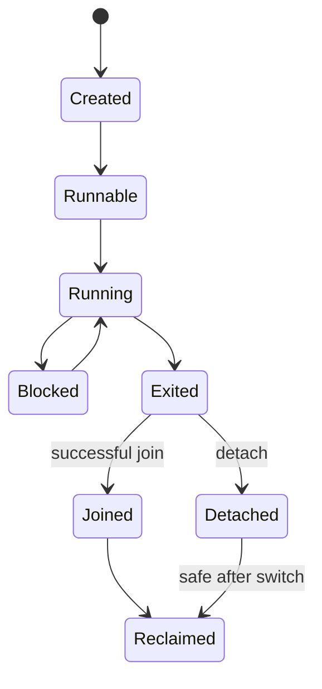

# Generic Native Thread Runtime

## 1. Purpose

This document defines the runtime-neutral native thread start/join primitive
used by Server services and future runtime adapters. It starts a native entry
function with an opaque context, captures a pointer-sized result, waits for
exit without polling, and reclaims the thread object exactly once.

The primitive is independent of managed runtimes, application inventory, and
the hosted task worker in the root `scheduler.*` files.

## 2. Existing thread model

The kernel already had an incomplete AMD64 scheduler thread path before this
primitive:

- one bootstrap TCB represented the initial kernel thread;
- a static 16-entry TCB pool supplied additional contexts;
- each TCB contained an embedded fixed 8 KiB stack;
- `arch::context::init_context` saved a void entry and argument in the initial
  callee-saved context slots;
- a FIFO runnable queue selected the next TCB;
- `thread_entry_wrapper` enabled interrupts, called the entry, and routed a
  normal return to `kernel_thread_exit`;
- the old exit path marked the TCB dead but had no result record, join owner,
  generation protection, or deterministic stack/object reclamation.

The root hosted `scheduler.*` is a different task worker using `std::thread`,
condition variables, and a vector queue. It is not used by this API.

## 3. Public generic API

The API is in `runtime/thread/guidexos_native_thread.h`:

```cpp
using NativeThreadEntry = uintptr_t (*)(void* context);

struct ThreadCreateOptions {
    size_t stackSize = 8192;
    const char* debugName = nullptr;
    bool detached = false;
};

ThreadResult createThread(NativeThreadEntry entry,
                          void* context,
                          const ThreadCreateOptions& options,
                          ThreadHandle* result);

WaitResult joinThread(ThreadHandle thread,
                      const WaitTimeout& timeout,
                      uintptr_t* exitResult);

ThreadResult detachThread(ThreadHandle thread);
```

Stack sizes are accepted only from 4096 through 16384 bytes and must be
16-byte multiples. A null entry or output handle is invalid. The debug name is
borrowed diagnostic text; it is not part of handle identity. The default is
joinable. No public API exposes a host thread object or a kernel TCB.

## 4. Thread handle and generation model

`ThreadHandle` is a small copyable value containing a static-pool slot and a
generation. It is a non-owning capability until a successful join consumes the
join ownership. There is no close operation on the handle itself.

Creation publishes a handle only after the slot, Event, stack, and initial
context are ready. Reclamation increments the slot generation before the slot
can be reused. A handle is valid only while both the slot and generation match;
an old handle cannot target a later occupant of the same slot.

The first join that succeeds consumes join ownership and returns the stored
result. A second join, a stale handle, a detached handle, or a self handle
returns `WaitResult::Invalid`. A timed-out join does not consume ownership.

## 5. Lifecycle states

Scheduler execution state remains the existing `ThreadState`:

```text
Runnable -> Running -> Blocked/TimedWait -> Running
Running -> Terminated
```

Thread-object ownership is separate:

```text
Unused -> Created -> Running -> Exited -> Joined -> Reclaimed
                              \-> Detached -> Reclaimed
```

`Terminated` means the execution context will not be scheduled again. It does
not mean that a joinable TCB or its stack is reusable. The exit result and
completion Event remain owned by the TCB until join or detach reclamation.



## 6. Stack ownership and bounds

The AMD64 kernel continues to use the existing static TCB pool. Each slot owns
a zeroed 16 KiB stack storage area. The requested active range is recorded as
`stack_base` (low address) and `stack_limit` (high address), and the context is
initialized from the requested high address. A join or deferred detach zeros
the stack and destroys the architecture context before the slot generation is
advanced.

The AMD64 build uses `-mno-red-zone`; the initial stack is 16-byte aligned and
the context frame is laid out so the first C call observes the normal AMD64
ABI alignment. Guard pages, page-backed dynamic stacks, stack growth, and
memory protection are not faked in this pass. The recorded bounds are the
future hook point for a runtime that needs stack discovery, but no managed
runtime consumes them here.

Hosted creation validates the same bounded size range. `std::thread` does not
provide a portable per-thread stack-size setting through this API, so hosted
stack size is a validated contract value while the host chooses its native
stack. This difference is documented rather than hidden as a kernel claim.

## 7. Entry trampoline

The current AMD64 context path remains the single architecture path:

```text
createThread request
  -> allocate existing KernelThread slot
  -> reset reusable WaitNode and completion Event
  -> zero and record stack bounds
  -> initialize SwitchContext
  -> enqueue FIFO runnable TCB
  -> first context switch
  -> thread_entry_wrapper
  -> enable normal interrupts
  -> native_entry_dispatch(TCB)
  -> NativeThreadEntry(context)
  -> store uintptr_t result
  -> kernel_thread_exit
```

The context initializer keeps the void dispatch function in the existing
entry slot and the TCB pointer in the argument slot. On AMD64 the initial
callee-saved `r12`/`r13` fields carry those values into the wrapper; no global
pending-entry variable is used. The wrapper never returns to an invalid
initial context. The generic trampoline does not know any language runtime.

## 8. Exit path

All ordinary entry returns use one kernel exit path. The native dispatch calls
the requested entry exactly once and stores its result before returning to the
architecture wrapper. `kernel_thread_exit` calls the current-thread exit path,
which:

1. removes any wait-node and timer registration;
2. removes the TCB from runnable selection;
3. marks execution `Terminated`;
4. stores the result record before signaling;
5. signals the TCB-owned manual-reset completion Event once;
6. selects another FIFO runnable TCB; and
7. switches away without freeing the current stack.

A terminated thread is never requeued. External arbitrary kill and forced
asynchronous cancellation are not part of this API. The pre-existing legacy
`terminate_thread` path rejects external termination of a native thread; the
process teardown path is the bounded exception described below.

## 9. Join semantics

`joinThread` validates the slot/generation, rejects self/detached/already
consumed handles, and waits on the existing generic `Event`. It does not poll.

For a join before exit, the caller parks on the completion Event, the target
stores its result and signals, and the caller wakes and consumes the result.
For a join after exit, the manual-reset Event is already signaled and the
operation completes immediately. A successful join then destroys the target's
architecture context, zeros its stack, advances its generation, and releases
the slot.

The Event is signaled exactly once. Event completion and scheduler wait-node
completion retain the existing signal-versus-timeout single-transition rule.

## 10. Timed join

Zero is a nonblocking poll. A finite timeout uses the hosted steady clock or
the bare-metal absolute PIT deadline through the existing scheduler wait
foundation. A timeout returns `WaitResult::TimedOut` and leaves the target,
result, Event, stack, and handle unchanged. A later infinite or finite join
can still succeed.

The timeout does not reset or consume the manual-reset completion Event. A
target that exits at the timeout boundary is resolved by the Event/scheduler
critical-section ordering already documented in
`docs/runtime/SCHEDULER_WAIT_QUEUE.md`.

## 11. Detach semantics

`detachThread` consumes join ownership without waiting. A live target is
marked detached and reclaims its slot after its ordinary exit. A terminated
target is reclaimed immediately when it is not the current TCB. Joining a
detached target is invalid, including after it exits. Repeated detach reports
`AlreadyDetached`.

The current thread cannot synchronously reclaim its own active stack. The
bare-metal exit path marks detached reclamation pending, switches to another
TCB, and lets a later stable scheduler operation reclaim the old slot. Hosted
detached workers detach their host object and reclaim their bounded slot after
publishing the result.

## 12. Process teardown

Each kernel TCB carries the owner PID of the creating current thread. The
generic create hook inherits that owner; the future runtime adapter does not
need to know the PID. `terminate_process_threads` is the existing bounded
teardown mechanism: it abandons wait/timer registrations, removes runnable
links, marks matching TCBs terminated, and prevents them from running more
application code. Native completion Events are signaled once with a teardown
marker so an external waiter is released rather than left pointing at a
freed object.

Non-current matching slots can be reclaimed safely after their active stack is
not running. The current matching TCB switches to another runnable TCB; if no
one exists, the existing interrupt-enabled HLT idle policy remains the
fallback. This is not a general forced-thread-kill protocol and does not claim
SMP-safe teardown. A process with more complex cross-process join ownership
must be rejected or kept alive until its documented owner completes.

## 13. Hosted implementation

`runtime/thread/guidexos_native_thread.cpp` uses a bounded 64-slot table, one
`std::thread` per live slot, and one generic `Event` per joinable completion.
The host worker stores its result, signals the Event, and either remains for
join or detaches/reclaims. A thread-local value identifies the current generic
handle for self-join rejection. Slot generations and invalid-operation
semantics match bare metal where the host facility permits it.

The public API never exposes `std::thread`. Native allocation is limited to
the hosted implementation's Event owner; successful join/detach releases it
deterministically. Hosted exception unwinding through a native entry is not a
supported entry contract; entries must return normally.

## 14. Bare-metal implementation

`runtime/thread/guidexos_native_thread_baremetal.cpp` is a thin runtime-neutral
dispatcher. The kernel installs three hooks during process initialization.
Those hooks operate on the existing `KernelThread` TCB and do not create a
second scheduler model or a second TCB type.

The AMD64 kernel path supplies the static slot pool, embedded stacks, context
initialization, FIFO enqueue, entry dispatch, result capture, Event signaling,
join, detach, generation checks, deferred reclamation, and bounded teardown.
Other architectures retain `NotSupported` until their existing context-switch
adapters can provide the same contract.

## 15. Scheduler interaction

Creation enters the existing single-CPU critical section while allocating the
TCB, resetting its reusable wait node, initializing its stack/context, and
enqueueing it. Join releases that critical section before Event parking. Event
wake-one or timer expiry reuses the scheduler's existing `makeRunnable` hook;
the target is never put back on the runnable queue after `Terminated`.

The current assumptions remain single CPU, interrupt-disabled short critical
sections, FIFO runnable selection, PIT-resolution timers, and a bounded eight
timer-expiration budget per tick. No SMP coordination, priority, affinity,
wait-many, or arbitrary asynchronous cancellation was added.

## 16. Event interaction

The target's completion is a manual-reset generic Event. A caller can use the
same generic Event primitive for request/done coordination around a worker.
The runtime thread layer only knows the completion Event; it does not add
event-specific scheduler behavior. Destruction/wait cancellation and TCB
wait-node reuse continue to be handled by the existing scheduler wait module.

## 17. Cleanup and reclamation

The ownership order is:

```text
entry result -> completion signal -> target no longer runnable
             -> safe context/stack cleanup -> generation increment -> slot reuse
```

The active TCB is never reclaimed synchronously from its own stack. A joined
or safely detached target has no active wait/timer link, no runnable link, no
live architecture context, and a zeroed stack before reuse. The static bare-
metal Event storage is embedded beside the pool and has no heap allocation;
the hosted Event state is released with its slot.

## 18. Test coverage

`runtime/tests/guidexos_native_thread_tests.cpp` independently covers:

- one worker, opaque context delivery, exactly-once entry, and pointer-sized
  result capture;
- join before exit, join after exit, zero poll, finite timeout, and join after
  timeout;
- request/done Event coordination;
- eight bounded workers with distinct contexts/results;
- TCB-slot reuse and stale-generation rejection;
- self join, double join, invalid handles, invalid stack size, and detach;
- deterministic Event/slot leak checks.

`runtime/tests/guidexos_native_thread_adapter_probe.cpp` exercises the
inactive isolated runtime-pack adapter: one plain native worker waits on one
Event, returns its opaque context value, is joined, and releases adapter
resources.

The generic hosted smoke is `scripts/smoke-native-thread-runtime.ps1`. The
bounded bare-metal smoke is
`scripts/smoke-native-thread-runtime-qemu.ps1`; it locates QEMU through an
explicit parameter, `GXOS_QEMU_X64`, PATH, or documented Windows locations,
builds private normal and opt-in test images, captures serial/fault logs, and
requires explicit QEMU PASS markers.

## 19. Current limitations

- Bare metal is validated on one AMD64 TCG CPU; SMP is not supported.
- The TCB pool is static and limited to 16 slots; hosted validation uses 64.
- Bare-metal stacks are embedded bounded storage without guard pages or growth.
- Bare-metal timing has PIT resolution and the existing eight-expiration tick
  budget.
- No wait-many, lock/critical-section API, SMP, priority, CPU affinity, thread
  pool, async, arbitrary kill, or forced cancellation was added.
- Process teardown is the existing bounded owner walk, not a general child
  process/thread supervisor.
- Hosted per-thread stack sizing is validated but delegated to the host.
- The QEMU test mode is opt-in and bypasses ordinary desktop startup; it is not
  a normal-boot regression test.

## 20. Future generic consumers

The next consumers can be native device helpers, IPC services, process
completion, language-runtime helper threads, and future driver work. Each must
use the same opaque handle/generation, Event completion, stack ownership, and
single exit path. A managed runtime adapter may map its own startup/attach
contract above this API, but it must not import the generic TCB layout or
change scheduler policy.

## 21. QEMU validation status

On 2026-07-16, the AMD64 path was executed under QEMU 11.0.0 TCG with one
virtual CPU. The exact executable was
`C:\Program Files\qemu\qemu-system-x86_64.exe`; it was not on PATH. The
validation used `-accel tcg,thread=single`, `-machine pc`, OVMF pflash, a
FAT ESP, `-display none`, serial-file capture, and `-no-reboot -no-shutdown`.
The QEMU and image identities are recorded in
`docs/runtime/NATIVE_THREAD_QEMU_VALIDATION.md` and the preserved run
directory under `out/runtime/native-thread-qemu-validation/`.

An ordinary image booted to `[KERNEL] Entering main loop (waiting for input)`
before the test image was enabled. The opt-in image then passed the bounded
single-worker, context/result, join-before-exit, join-after-exit, zero and
finite timed join, retry, TCB reuse/generation, stale-handle, detach,
multiple-worker, wait/timer cleanup, process-teardown, and leak checks. The
serial trace observed first scheduling, entry invocation, result publication,
completion signaling, join wake, and reclamation. The AMD64 context correction
was limited to the initial stack frame/ABI and saved-context resume layout;
the bare-metal Event correction distinguished finite zero polls from infinite
waits. No GC initialization, collection, finalizer thread, managed thread, or
default inventory change was made.

The remaining limitations are the documented single-CPU/static-pool/PIT
constraints, lack of guard pages and dynamic stack growth, and the absence of
a general forced process-thread kill protocol. The full validation record and
exact next experiment are in the companion QEMU document.
