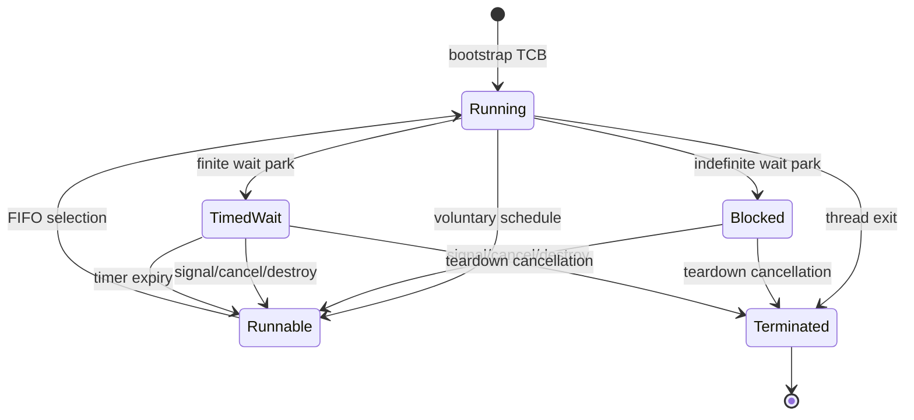

# Scheduler Wait Queue

## 1. Purpose

This document defines the smallest runtime-neutral scheduler capability needed
for native blocking waits. It is intentionally independent of any particular
synchronization object or language runtime. The first consumer is the generic
guideXOS event, but the same contract can serve semaphores, IPC readiness,
device completion, process completion, and thread joins later.

The implementation is allocation-free on bare metal. A wait object embeds a
`WaitQueue`; each scheduler thread owns one reusable `WaitNode`.

## 2. Existing scheduler model

The repository contains two distinct scheduler-like facilities:

- The root `scheduler.*` is a hosted task worker using `std::thread`, a mutex,
  a condition variable, and a vector-backed task queue. It is not the kernel
  scheduler and is unchanged by this wait foundation.
- The freestanding kernel previously had a 16-entry process table,
  architecture context-switch code, a `schedule()` halt stub, and a PIT tick
  counter. It had no runnable queue, thread lifecycle, wait queue, or timer
  wake registration.

The new kernel path is single-CPU. It initializes a bootstrap TCB, maintains a
FIFO runnable queue, uses the existing AMD64 context switch, and calls the
generic timer list from the PIT handler. No managed thread, thread pool, task,
or collector startup path is added.

Current lifecycle:



The current kernel still uses its existing HLT behavior when a blocked wait
has no alternate runnable TCB. This is an idle path, not a polling loop. A PIT
interrupt, signal, or destruction completion makes the parked TCB runnable and
the park operation resumes it.

## 3. Thread state changes

`kernel::process::ThreadState` adds `Runnable`, `Running`, `Blocked`,
`TimedWait`, and `Terminated`. `TimedWait` is kept distinct for diagnostics and
timer invariants; both blocked states are absent from the runnable queue.

Each AMD64 kernel TCB now contains:

- stable TID and owning PID;
- state, liveness, and runnable-queue links;
- a fixed kernel stack and architecture context;
- one embedded scheduler wait node.

Thread identifiers are assigned monotonically for the static TCB pool and are
not changed by blocking or wakeup. The current bootstrap thread is TID 1.

## 4. Wait contract

`runtime/synchronization/guidexos_scheduler_wait.*` provides:

1. `prepareWait` publishes a node into an object-owned wait queue and, for a
   finite duration, into the ordered timer list.
2. `parkWait` delegates the current thread transition to the scheduler.
3. `wakeOne` completes the FIFO head.
4. `wakeAll` completes every node safely while unlinking.
5. `cancelWait` completes one node with a cancellation/destruction reason.
6. `abandonWait` unlinks a terminating thread without requeueing it.
7. `processExpired` completes due timers with bounded interrupt-context work.

The completion reasons are `Signaled`, `TimedOut`, `Cancelled`, `Destroyed`,
and `Interrupted`. `None` is internal and is never a final result. A node can
make exactly one transition from `Waiting` to `Completed`; completion unlinks
both object and timer registrations before notifying the platform runnable
queue.

## 5. Wait-node ownership

The synchronization object owns only its `WaitQueue` links. The scheduler TCB
owns the reusable `WaitNode`, so prepare/park/wake paths allocate nothing and
one thread cannot wait on two independent objects at once.

The node records:

- owning TCB pointer;
- object-owned queue and intrusive previous/next links;
- timer previous/next links;
- absolute monotonic deadline;
- generation token, incremented for each reuse;
- completion reason and node state;
- timed, queue-linked, and timer-linked flags.

After `parkWait` copies the final reason, it returns the node to `Idle`. A
completed node is therefore reusable for sequential waits. A stale timer or
wake path sees a non-`Waiting` node and cannot complete a later generation.

## 6. Park operation

The event holds the installed short critical section while checking its state
and calling `prepareWait`. The node is fully linked before that section is
released. `parkWait` then calls the kernel park hook:

1. re-enter the scheduler critical section;
2. if the node already completed, return its reason without queue insertion;
3. mark the TCB `Blocked` or `TimedWait`;
4. remove it from runnable selection;
5. select the FIFO runnable head;
6. release the critical section before context switching;
7. switch to the selected TCB, or use the existing HLT idle behavior;
8. resume only after the node has a final completion reason.

This closes the prepare/park lost-wakeup window. The implementation assumes a
single CPU; multi-CPU signal and scheduler locking are not claimed.

Parking from interrupt context is not exposed as a supported operation. IRQ
paths only complete nodes and enqueue runnable TCBs.

## 7. Wake-one

`wakeOne` selects the queue head, which is deterministic FIFO order for the
current implementation. It performs one completion transition, removes the
timer registration, and calls the platform `makeRunnable` hook once. A TCB
already running during a completion-before-park race is not inserted again.

No broader fairness guarantee is made. Priority, aging, and priority
inheritance are outside this pass.

## 8. Wake-all

`wakeAll` walks the queue by saving the next link before each completion. Every
eligible waiter is completed once and made runnable once. It returns the exact
number awakened. The event uses this for manual-reset signal and destruction.

## 9. Timer wake registration

The scheduler owns one intrusive, deadline-ordered timer list. `prepareWait`
asks the installed platform for the current monotonic tick and converts the
relative nanosecond duration to ticks. `processExpired(now, budget)` removes
due nodes from the head and wakes at most `budget` nodes per timer interrupt.
The initial PIT budget is eight.

Timer cancellation is part of every completion path: signal, destruction,
explicit cancellation, timeout, and thread teardown. A timer callback never
keeps a node linked after completion.

## 10. Timeout representation

The internal representation is an absolute 64-bit monotonic deadline. The
kernel adapter converts nanoseconds to PIT ticks using ceiling rounding, so a
positive duration is never silently treated as a zero-time poll. Wall-clock
time is not used.

Deadline comparisons use unsigned wrap-safe half-range ordering. The caller
must not request a duration spanning half the counter range; practical PIT
durations are far below that boundary.

Zero timeout is handled by the event before `prepareWait` and never registers a
timer. Infinite timeout sets no deadline.

## 11. Signal/timeout race resolution

The generic `complete` helper is the one atomic logical transition. On the
single CPU, event state, queue links, timer links, and runnable insertion are
serialized by the same interrupt-disabled critical section. The first path to
complete the node wins:

```text
Waiting -> Signaled
Waiting -> TimedOut
Waiting -> Cancelled/Destroyed
```

If signal wins, the timer is removed and later timeout processing does nothing.
If timeout wins, the node is removed and a later auto-reset signal sees no
waiter, retaining one pending signal. The timed-out waiter never rechecks or
consumes a later event signal.

For auto-reset events, signal reservation is done at wake-one time: a signal
assigned to a waiter clears the pending bit immediately; a signal with no
waiter retains the one pending bit. Repeated signals while pending remain one
bit.

## 12. Lock ordering

The current single-CPU implementation deliberately reduces lock count:

| Rank | Protected state | Rule |
| --- | --- | --- |
| 1 | interrupt/scheduler critical section | Enter before queue, timer, runnable, or TCB state changes. |
| 2 | object state plus embedded wait queue | Event state is checked/updated while rank 1 is held. |
| 3 | timer list and runnable links | Manipulated by the generic completion path while rank 1 is held. |

There is no independent event mutex, timer mutex, or TCB mutex in bare metal.
The PIT handler runs with interrupts disabled and does not acquire a second
lock. `makeRunnable` never context-switches. Context switching occurs only
after the critical section is released.

The hosted event keeps its existing lifecycle/state mutexes and condition
variable; it does not depend on this bare-metal contract.

## 13. Cancellation

`cancelWait` completes an active node and requeues its TCB with the supplied
reason. `abandonWait` is for teardown: it removes queue and timer links,
records cancellation, and never requeues the terminating TCB. Repeated cancel,
wake, or timeout attempts observe `Completed`/`Idle` and do nothing.

## 14. Thread teardown

`terminate_thread` and `terminate_process_threads` call `abandonWait` before
marking TCBs terminated. This prevents a timer or object queue from retaining
a freed/invalid thread pointer and prevents duplicate runnable insertion. TIDs
remain stable while a TCB is live; the static pool is not reclaimed in this
pass.

## 15. Process teardown

Each kernel TCB carries its owning PID. The process teardown helper walks only
that static TCB pool, abandons blocked/timed waits, removes runnable links, and
marks matching threads terminated. If the current TCB is among the matches,
the helper selects another runnable TCB before switching. No existing kernel
process caller currently creates child threads, so this path is an explicit
foundation API rather than a change to application inventory or process
policy.

## 16. Object destruction

Bare-metal `Event::close` marks the object destroyed and calls generic
`wakeAll(..., Destroyed)`. Every waiter is unlinked before `close` returns. A
waiter returns from its park using the copied completion reason and does not
dereference the event object after park, so the old active-waiter rejection and
destructor trap are no longer required.

New operations on a closed event remain `Invalid`; an already blocked waiter
receives `Destroyed`. This is the event's explicit destruction semantics.

## 17. Bare-metal event integration

`guidexos_event_baremetal.cpp` uses only `scheduler_wait` operations. It keeps
manual-reset and auto-reset state local to the event, embeds the generic wait
queue in its state, and never teaches the scheduler about event modes.

Manual reset sets the bit and wakes all. Auto reset either consumes a pending
bit immediately or reserves a signal for exactly one awakened waiter. Reset
does not wake waiters. Zero, finite, and infinite waits share the generic
prepare/park path after the event predicate check.

## 18. Test coverage

`runtime/tests/guidexos_scheduler_wait_tests.cpp` is a deterministic
freestanding-contract model. It covers park/wake-one, wake-all, immediate
completion, zero and finite timeout behavior, signal-before-timeout,
timeout-before-signal, cancellation, timer cancellation, teardown unlinking,
reuse, duplicate runnable protection, and bare-metal manual/auto event
integration including destruction.

`runtime/tests/guidexos_event_tests.cpp` remains the hosted condition-variable
regression suite. The native smoke builds the freestanding objects, runs the
deterministic scheduler/event model, and runs the inactive adapter probe.

The kernel AMD64 objects are also compiled with the freestanding flags. A full
QEMU concurrent multi-thread runtime test is not available in the current
desktop harness.

## 19. Known limitations

- The scheduler is single-CPU; SMP wake races are not implemented.
- The kernel still has a minimal static TCB pool and no general process child
  list or user-thread policy.
- PIT resolution is the configured periodic tick; high-resolution timers and
  timer coalescing are not provided.
- Timer expiry work is bounded at eight nodes per tick; a long burst drains
  over later ticks.
- Wait-many, wait sets, condition variables, semaphores, priority inheritance,
  and interruptible external cancellation are not implemented.
- The deterministic bare-metal model is not a substitute for a booted QEMU
  concurrent runtime test.

## 20. Future generic consumers

Future consumers can embed a `WaitQueue` and use the same prepare/park,
wake-one, wake-all, timer, cancellation, and teardown contract. Candidates are
IPC/mailbox readiness, device completion, process/thread joins, and other
runtime-neutral native services. The scheduler must remain unaware of the
consumer's state machine.

